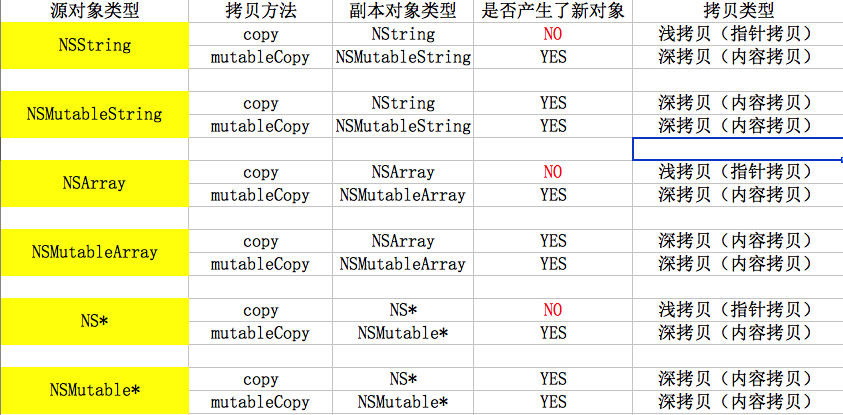

# copy



- 自定义copy

```objc

- (id)copyWithZone:(NSZone *)zone
{
    XMGPerson *person = [[XMGPerson allocWithZone:zone] init];
    person.age = self.age;
//    person.money = self.money;
    return person;
}

```
