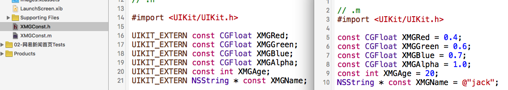

# const和指针

```objc

      const int *p1; // *p1指向的内容不能变

      int const *p2; // 同上
      int * const p3; // p3 储存的地址不能变
```

## 用const取代宏常量
- 宏仅仅是替换, 在内容中会有很多份
- 为了解决这个问题, 苹果用const, 全局使用的都是同一份内存中的常量


