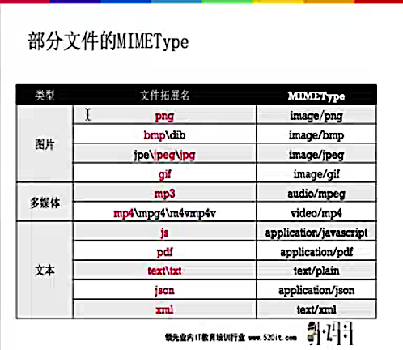

# MIMEType




### 获得文件的MIMEType

```objc

- (void)MIMEType
{
    //    NSString *url = @"file:///Users/xiaomage/Desktop/test.pptx";
//        NSString *urlString = @"file:///Users/xiaomage/Desktop/test.png";
//        NSURL *url = [NSURL URLWithString:urlString];

    NSURL *url = [NSURL fileURLWithPath:@"/Users/xiaomage/Desktop/test.png"];
    NSURLRequest *request = [NSURLRequest requestWithURL:url];

        [NSURLConnection sendAsynchronousRequest:request queue:[NSOperationQueue mainQueue] completionHandler:^(NSURLResponse *response, NSData *data, NSError *connectionError) {
            NSLog(@"%@", response.MIMEType);
        }];


}

- (NSString *)getMIMEType:(NSString *)file
{
    NSURLResponse *response = nil;
    NSURLRequest *request = [NSURLRequest requestWithURL:[NSURL URLWithString:file]];
    [NSURLConnection sendSynchronousRequest:request returningResponse:&response error:nil];
    return response.MIMEType;
}

+ (NSString *)mimeTypeForFileAtPath:(NSString *)path
{
    if (![[NSFileManager defaultManager] fileExistsAtPath:path]) {
        return nil;
    }
    CFStringRef UTI = UTTypeCreatePreferredIdentifierForTag(kUTTagClassFilenameExtension, (__bridge  CFStringRef)[path pathExtension], NULL);
    CFStringRef MIMEType = UTTypeCopyPreferredTagWithClass (UTI, kUTTagClassMIMEType);
    CFRelease(UTI);
    if (!MIMEType) {
        return @"application/octet-stream";
    }
    return (__bridge NSString *)MIMEType;
}

```
