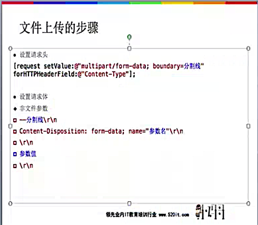

# NSURLSession

## NSURLSession的基础用法

### get1-data--`dataTaskWithRequest:completionHandler`

```objc

- (void)get
{
    // 获得NSURLSession对象
    NSURLSession *session = [NSURLSession sharedSession];

    // 创建任务
    NSURLSessionDataTask *task = [session dataTaskWithRequest:[NSURLRequest requestWithURL:[NSURL URLWithString:@"http://120.25.226.186:32812/login?username=123&pwd=4324"]] completionHandler:^(NSData *data, NSURLResponse *response, NSError *error) {
        NSLog(@"%@", [NSJSONSerialization JSONObjectWithData:data options:kNilOptions error:nil]);
    }];


    // 启动任务
    [task resume];
}

```

### get2-data-`dataTaskWithURL: completionHandler:`

```objc

- (void)get2
{
    // 获得NSURLSession对象
    NSURLSession *session = [NSURLSession sharedSession];

    // 创建任务, 不用自己写request了,系统内部帮助做
    NSURLSessionDataTask *task = [session dataTaskWithURL:[NSURL URLWithString:@"http://120.25.226.186:32812/login?username=123&pwd=4324"] completionHandler:^(NSData *data, NSURLResponse *response, NSError *error) {
        NSLog(@"%@", [NSJSONSerialization JSONObjectWithData:data options:kNilOptions error:nil]);
    }];

    // 启动任务
    [task resume];
}

```

### post必须用可变的`NSMutableRequest` `dataTaskWithRequest:completionHandler`

```objc
- (void)post
{
    // 获得NSURLSession对象
    NSURLSession *session = [NSURLSession sharedSession];

    // 创建请求
    NSMutableURLRequest *request = [NSMutableURLRequest requestWithURL:[NSURL URLWithString:@"http://120.25.226.186:32812/login"]];
    request.HTTPMethod = @"POST"; // 请求方法
    request.HTTPBody = [@"username=520it&pwd=520it" dataUsingEncoding:NSUTF8StringEncoding]; // 请求体

    // 创建任务
    NSURLSessionDataTask *task = [session dataTaskWithRequest:request completionHandler:^(NSData *data, NSURLResponse *response, NSError *error) {
        NSLog(@"%@", [NSJSONSerialization JSONObjectWithData:data options:kNilOptions error:nil]);
    }];

    // 启动任务
    [task resume];
}

```


### download-`downloadTaskWithURL: completionHandler:` 可以下载大文件和小文件

```objc

- (void)download
{
    // 获得NSURLSession对象
    NSURLSession *session = [NSURLSession sharedSession];

    // 获得下载任务
    NSURLSessionDownloadTask *task = [session downloadTaskWithURL:[NSURL URLWithString:@"http://120.25.226.186:32812/resources/videos/minion_01.mp4"] completionHandler:^(NSURL *location, NSURLResponse *response, NSError *error) {
        // 文件将来存放的真实路径
        NSString *file = [[NSSearchPathForDirectoriesInDomains(NSCachesDirectory, NSUserDomainMask, YES) lastObject] stringByAppendingPathComponent:response.suggestedFilename];

        // 剪切location的临时文件到真实路径
        NSFileManager *mgr = [NSFileManager defaultManager];

        [mgr moveItemAtURL:location toURL:[NSURL fileURLWithPath:file] error:nil];
    }];

    // 启动任务
    [task resume];
}

```

## NSURLSessionDataDelegate 适用于小文件和大文件的传输下载,
## 不过要用到`NSOutputStream`或者`NSFileHandle`

- 注意点:接受到服务器响应的时候
    - 允许处理服务器的响应，才会继续接收服务器返回的数据

```objc

- (void)touchesBegan:(NSSet *)touches withEvent:(UIEvent *)event {

    // 获得NSURLSession对象
    NSURLSession *session = [NSURLSession sessionWithConfiguration:[NSURLSessionConfiguration defaultSessionConfiguration] delegate:self delegateQueue:[[NSOperationQueue alloc] init]];

    // 创建任务
    NSURLSessionDataTask *task = [session dataTaskWithRequest:[NSURLRequest requestWithURL:[NSURL URLWithString:@"http://120.25.226.186:32812/login?username=123&pwd=4324"]]];

    // 启动任务
    [task resume];
}
#pragma mark - <NSURLSessionDataDelegate>
/**
 * 1.接收到服务器的响应
 */

- (void)URLSession:(NSURLSession *)session dataTask:(NSURLSessionDataTask *)dataTask didReceiveResponse:(NSURLResponse *)response completionHandler:(void (^)(NSURLSessionResponseDisposition))completionHandler
{
    NSLog(@"%s", __func__);

    // 允许处理服务器的响应，才会继续接收服务器返回的数据
    completionHandler(NSURLSessionResponseAllow);

    // void (^)(NSURLSessionResponseDisposition)
}

/**
 * 2.接收到服务器的数据（可能会被调用多次）
 */
- (void)URLSession:(NSURLSession *)session dataTask:(NSURLSessionDataTask *)dataTask didReceiveData:(NSData *)data
{
    NSLog(@"%s", __func__);
}

/**
 * 3.请求成功或者失败（如果失败，error有值）
 */
- (void)URLSession:(NSURLSession *)session task:(NSURLSessionTask *)task didCompleteWithError:(NSError *)error
{
    NSLog(@"%s", __func__);
}

@end

```

## download-大文件无断点下载 <NSURLSessionDownloadDelegate>非常实用

```objc

- (void)download
{
    // 获得NSURLSession对象
    NSURLSession *session = [NSURLSession sessionWithConfiguration:[NSURLSessionConfiguration defaultSessionConfiguration] delegate:self delegateQueue:[[NSOperationQueue alloc] init]];

    // 获得下载任务
    NSURLSessionDownloadTask *task = [session downloadTaskWithURL:[NSURL URLWithString:@"http://120.25.226.186:32812/resources/videos/minion_01.mp4"]];

    // 启动任务
    [task resume];
}

#pragma mark - <NSURLSessionDownloadDelegate>
- (void)URLSession:(NSURLSession *)session task:(NSURLSessionTask *)task didCompleteWithError:(NSError *)error
{
    NSLog(@"didCompleteWithError");
}

- (void)URLSession:(NSURLSession *)session downloadTask:(NSURLSessionDownloadTask *)downloadTask didResumeAtOffset:(int64_t)fileOffset expectedTotalBytes:(int64_t)expectedTotalBytes
{
    NSLog(@"didResumeAtOffset");
}

/**
 * 每当写入数据到临时文件时，就会调用一次这个方法
 * totalBytesExpectedToWrite:总大小
 * totalBytesWritten: 已经写入的大小
 * bytesWritten: 这次写入多少
 */
- (void)URLSession:(NSURLSession *)session downloadTask:(NSURLSessionDownloadTask *)downloadTask didWriteData:(int64_t)bytesWritten totalBytesWritten:(int64_t)totalBytesWritten totalBytesExpectedToWrite:(int64_t)totalBytesExpectedToWrite
{
    NSLog(@"--------%f", 1.0 * totalBytesWritten / totalBytesExpectedToWrite);
}

/**
 *
 * 下载完毕就会调用一次这个方法
 */
- (void)URLSession:(NSURLSession *)session downloadTask:(NSURLSessionDownloadTask *)downloadTask didFinishDownloadingToURL:(NSURL *)location
{
    // 文件将来存放的真实路径
    NSString *file = [[NSSearchPathForDirectoriesInDomains(NSCachesDirectory, NSUserDomainMask, YES) lastObject] stringByAppendingPathComponent:downloadTask.response.suggestedFilename];

    // 剪切location的临时文件到真实路径
    NSFileManager *mgr = [NSFileManager defaultManager];
    [mgr moveItemAtURL:location toURL:[NSURL fileURLWithPath:file] error:nil];
}

@end

```

## 文件上传无断点
- 1,设置请求头(告诉服务器,这是一个文件上传的请求)
- 2, 设置请求体
- 3, `uploadTaskWithRequest`





```objc


#define XMGBoundary @"520it"
#define XMGEncode(string) [string dataUsingEncoding:NSUTF8StringEncoding]
#define XMGNewLine [@"\r\n" dataUsingEncoding:NSUTF8StringEncoding]

#import "ViewController.h"

@interface ViewController ()
/** session */
@property (nonatomic, strong) NSURLSession *session;
@end

@implementation ViewController

- (NSURLSession *)session
{
    if (!_session) {
        NSURLSessionConfiguration *cfg = [NSURLSessionConfiguration defaultSessionConfiguration];
        cfg.timeoutIntervalForRequest = 10;
        // 是否允许使用蜂窝网络（手机自带网络）
        cfg.allowsCellularAccess = YES;
        _session = [NSURLSession sessionWithConfiguration:cfg];
    }
    return _session;
}

- (void)viewDidLoad {
    [super viewDidLoad];

}

- (void)touchesBegan:(NSSet *)touches withEvent:(UIEvent *)event {
    NSMutableURLRequest *request = [NSMutableURLRequest requestWithURL:[NSURL URLWithString:@"http://120.25.226.186:32812/upload"]];
    request.HTTPMethod = @"POST";

    // 设置请求头(告诉服务器,这是一个文件上传的请求)
    [request setValue:[NSString stringWithFormat:@"multipart/form-data; boundary=%@", XMGBoundary] forHTTPHeaderField:@"Content-Type"];

    // 设置请求体
    NSMutableData *body = [NSMutableData data];

    // 文件参数
    // 分割线
    [body appendData:XMGEncode(@"--")];
    [body appendData:XMGEncode(XMGBoundary)];
    [body appendData:XMGNewLine];

    // 文件参数名
    [body appendData:XMGEncode([NSString stringWithFormat:@"Content-Disposition: form-data; name=\"file\"; filename=\"test.png\""])];
    [body appendData:XMGNewLine];

    // 文件的类型
    [body appendData:XMGEncode([NSString stringWithFormat:@"Content-Type: image/png"])];
    [body appendData:XMGNewLine];

    // 文件数据
    [body appendData:XMGNewLine];
    [body appendData:[NSData dataWithContentsOfFile:@"/Users/xiaomage/Desktop/test.png"]];
    [body appendData:XMGNewLine];

    // 结束标记
    /*
     --分割线--\r\n
     a
     */
    [body appendData:XMGEncode(@"--")];
    [body appendData:XMGEncode(XMGBoundary)];
    [body appendData:XMGEncode(@"--")];
    [body appendData:XMGNewLine];

    [[self.session uploadTaskWithRequest:request fromData:body completionHandler:^(NSData *data, NSURLResponse *response, NSError *error) {
        NSLog(@"-------%@", [NSJSONSerialization JSONObjectWithData:data options:kNilOptions error:nil]);
    }] resume];
}

@end


```


