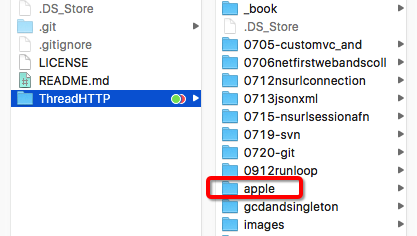
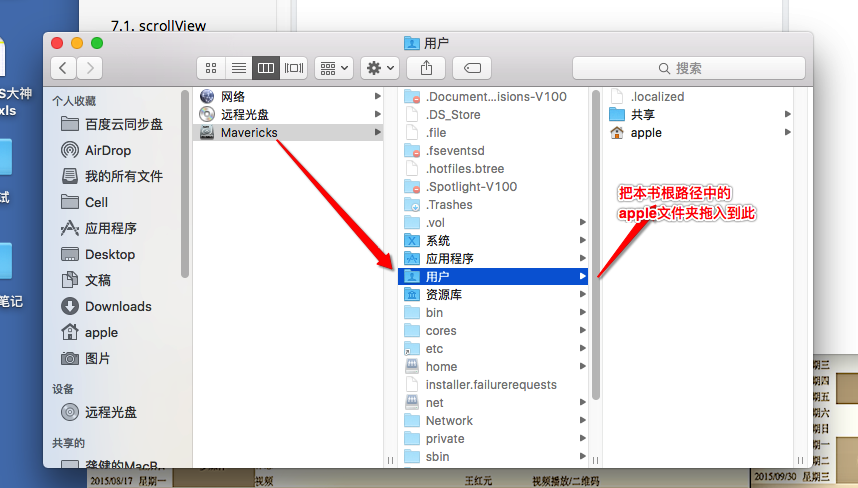

##多线程网络,

##如有不正确的地方还望改正

### 联系 64hp@163.com

### gitbook下载地址`https://github.com/NJHu/gitbook-dmg.git`

##`关于图片加载不了的的问题`

## 由于是离线图片所以需要另外导入路径

### 把本书中根路径的`**apple**`文件夹拖入到电脑用户文件夹



---

## 本流程学完后的补缺

`- 0, svn 和 git 本流程完成`-已完成

`- 1, 百思不得姐里边的 `dynamic`物理动画`
`- 2, 瀑布流- 也在百思不得姐里边有`
- 3, UI补充里边的真机相关调试
- 4, sq-lite. 数据库的操作

## 常用的宏


```objc

#define LMJKeyPath(obj, key) @(((void)obj.key, #key))

    LMJKeyPath(p, name); @"name"

#define LMJAngle2Radion(angle) ((angle) / 180.0 * M_PI)

#define LMJFuncLog NSLog(@"%s", __func__)

#define LMJLog(...) NSLog(@"%@", [NSString stringWithUTF8String:#__VA_ARGS__])


#ifdef __OBJC__


#define LMJFuncLog NSLog(@"%s", __func__)

#define LMJLog(...) NSLog(@"%@", [NSString stringWithUTF8String:#__VA_ARGS__])


#endif

<key>NSAppTransportSecurity</key>
<dict>
<key>NSAllowsArbitraryLoads</key>
<true/>
</dict>

sudo apachectl -k restart

```
