# NSOperationQueue

## GCD的队列类型
- 并发队列
    - 自己创建的
    - 全局
- 串行队列
    - 主队列
    - 自己创建的

## NSOperationQueue的队列类型
- 主队列
    - [NSOperationQueue mainQueue]
    - 凡是添加到主队列中的任务（NSOperation），都会放到主线程中执行
- 非主队列（其他队列）
    - [[NSOperationQueue alloc] init]
    - 同时包含了：串行、并发功能
    - 添加到这种队列中的任务（NSOperation），就会自动放到子线程中执行

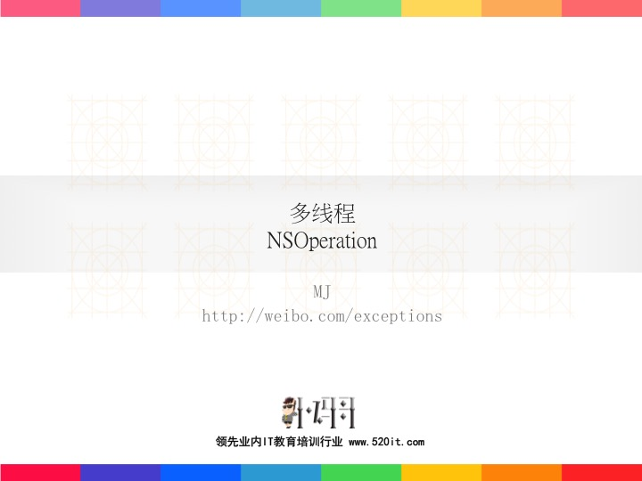

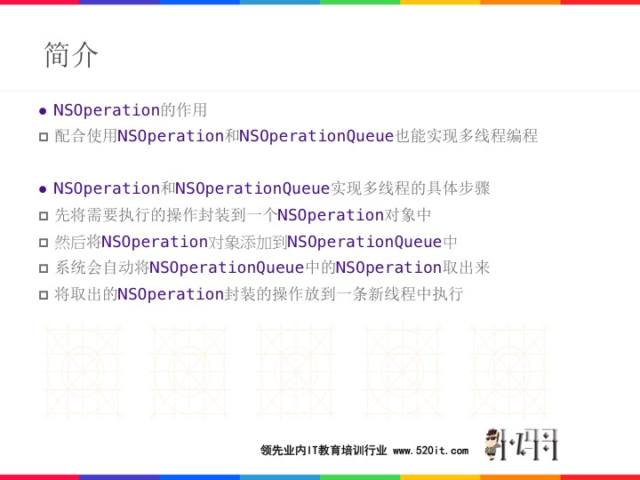

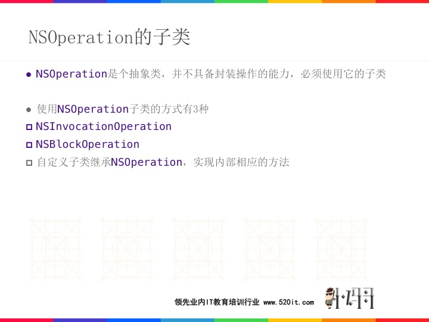

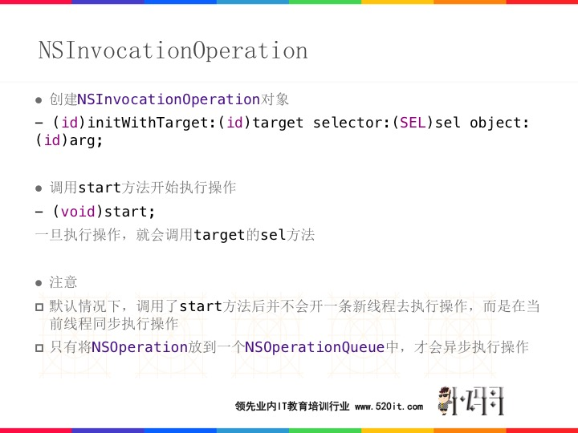

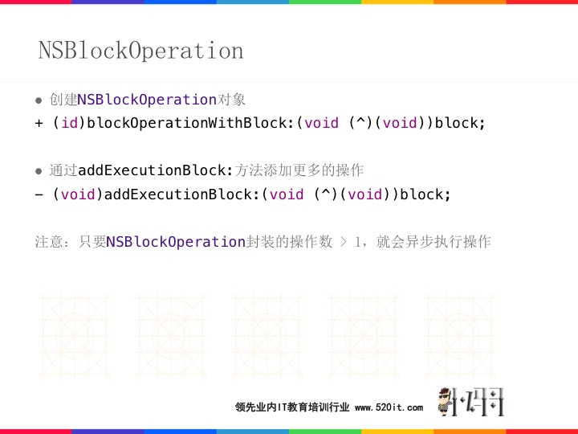

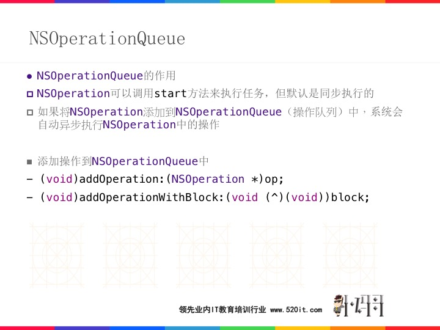

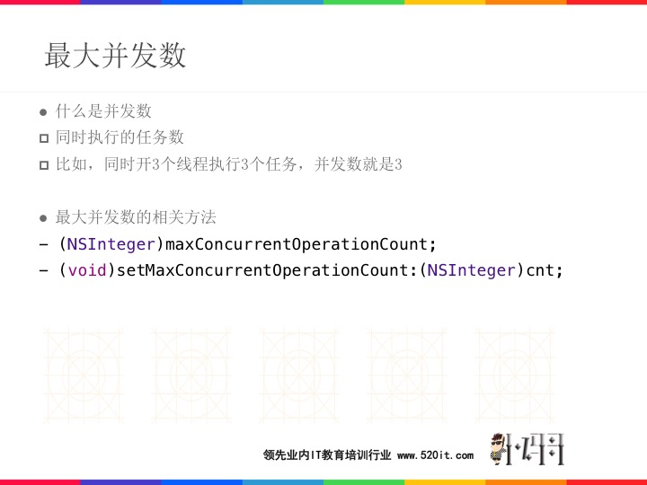

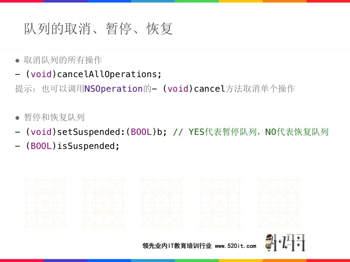

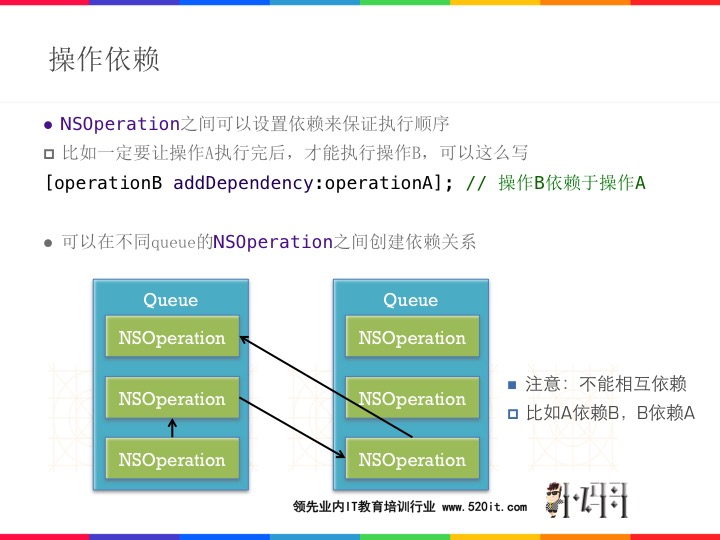

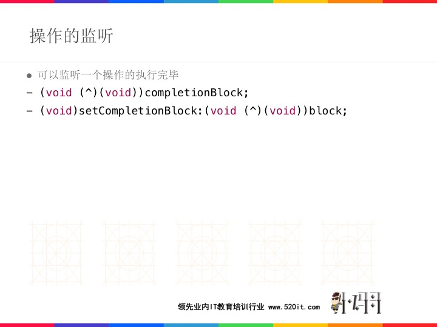

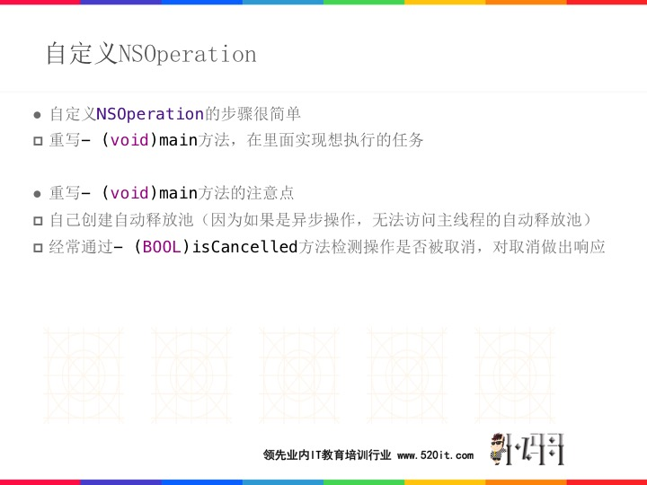

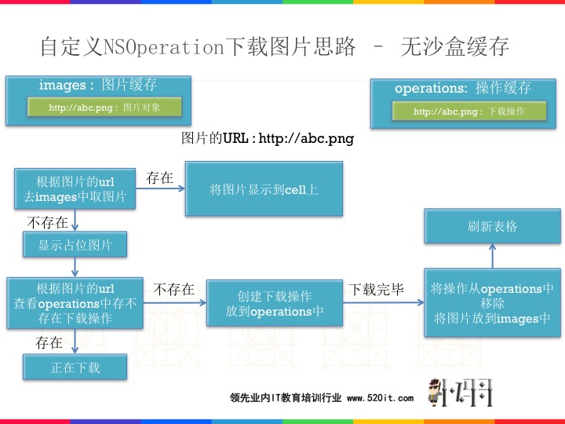

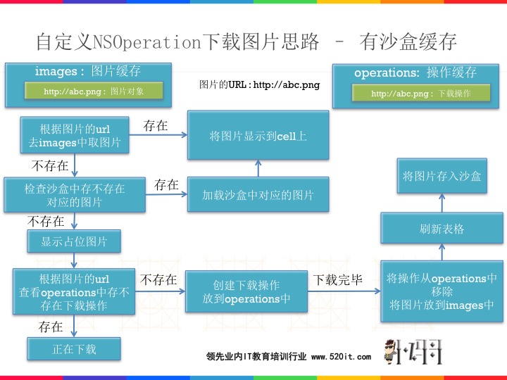
