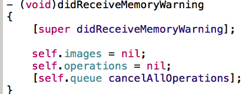

# SDWebImage

```objc


    [cell.imageView sd_setImageWithURL:[NSURL URLWithString:app.icon]
    placeholderImage:[UIImage imageNamed:@"placeholder"]];


    [cell.imageView sd_setImageWithURL:[NSURL URLWithString:app.icon] placeholderImage:
    [UIImage imageNamed:@"placeholder"] options:0 progress:
    ^(NSInteger receivedSize, NSInteger expectedSize) {
        // expectedSize: 图片的总字节数
        // receivedSize: 已经接收的图片字节数

        NSLog(@"下载进度：%f", 1.0 * receivedSize / expectedSize);
    } completed:
    ^(UIImage *image, NSError *error, SDImageCacheType cacheType, NSURL *imageURL) {
        NSLog(@"下载完图片");
    }];


    [[SDWebImageManager sharedManager] downloadImageWithURL:nil options:0
    progress:^(NSInteger receivedSize, NSInteger expectedSize) {

    } completed:
    ^(UIImage *image, NSError *error, SDImageCacheType cacheType, BOOL finished, NSURL *imageURL)
    {

    }];

    // 清除内存缓存
    [[SDWebImageManager sharedManager].imageCache clearMemory];
    // 取消所有下载
    [[SDWebImageManager sharedManager] cancelAll];


```

- 接受到内存警告的处理-2




### gifDemo

```objc
- (void)gifDemo
{
    //方式1
    //    self.MyImageView.image = [UIImage sd_animatedGIFNamed:@"2"];
    //方式2
    //获取路径
    NSString *path = [[NSBundle mainBundle]pathForResource:@"2.gif" ofType:nil];
    //转成data
    NSData *data = [NSData dataWithContentsOfFile:path];
    self.MyImageView.image = [UIImage sd_animatedGIFWithData:data];

}

```

