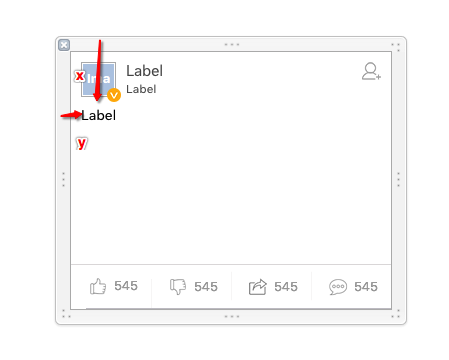
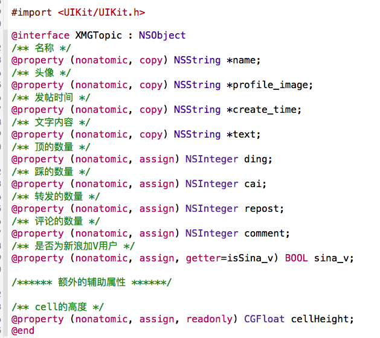

# add contentTEXT,

- 1, 为cell的xib增加文字内容的label, xy固定, 宽度固定, 行数设为0




- 2, 在模型里边增加一个cell的模型高度辅助属性



- 3, 在LMJTopicVc里边直接调用

```objc

#pragma mark - 代理方法
- (CGFloat)tableView:(UITableView *)tableView heightForRowAtIndexPath:(NSIndexPath *)indexPath
{
    // 取出帖子模型
    XMGTopic *topic = self.topics[indexPath.row];

    // 返回这个模型对应的cell高度
    return topic.cellHeight;
}

```

- 4, 在模型的辅助属性高度里边,的getter方法直接算出模型的高度, 仅仅是包含文字的高度
    - 文字的宽度是由屏幕的宽度来减去一些间距来决定

```objc

- (CGFloat)cellHeight
{
    if (!_cellHeight) {
        // 先加到字体的Y第地方 + 内容距离底部条的间距+底部的条高度+cell内部减去的间距
        _cellHeight += LMJTopicCellTextLabelY + LMJTopicCellEdgeMargin
        + LMJTopicCellBottomBarHeight + LMJTopicCellEdgeMargin;

        // 计算里边   文字高度1+间距+图片2
//        CGFloat textLabelMaxWidth = LMJMainScreenWidth - 4 * LMJTopicCellEdgeMargin;

        CGFloat textLabelMaxWidth = LMJMainScreenWidth - 2 * LMJTopicCellEdgeMargin;

        CGFloat textLabelHeight = [self.text boundingRectWithSize:CGSizeMake(textLabelMaxWidth, MAXFLOAT) options:NSStringDrawingUsesLineFragmentOrigin attributes:@{NSFontAttributeName : [UIFont systemFontOfSize:14]} context:nil].size.height;

        // 加上文字的高度
        _cellHeight += textLabelHeight;
    }
    return _cellHeight;
}

```


- 5, 由于cell, xib里边的contenttextlabel没有设置高度, 它会自动根据内容, lebel的高度会随着内容改变而改变
    - cell里边底部(ding, zan,  cai, )的条会随着cell的高度变化永远黏着底部

- 6 , 段子搞定了!!!!


