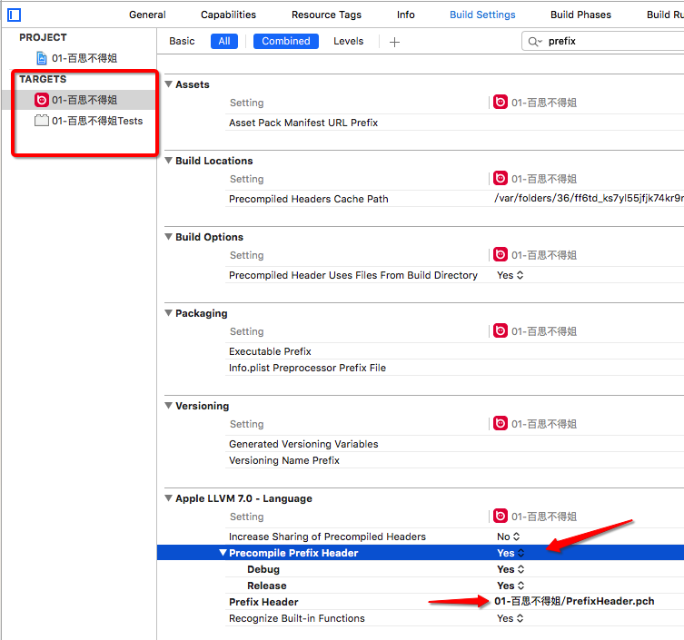
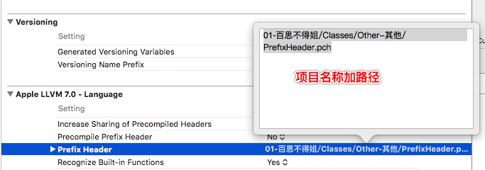
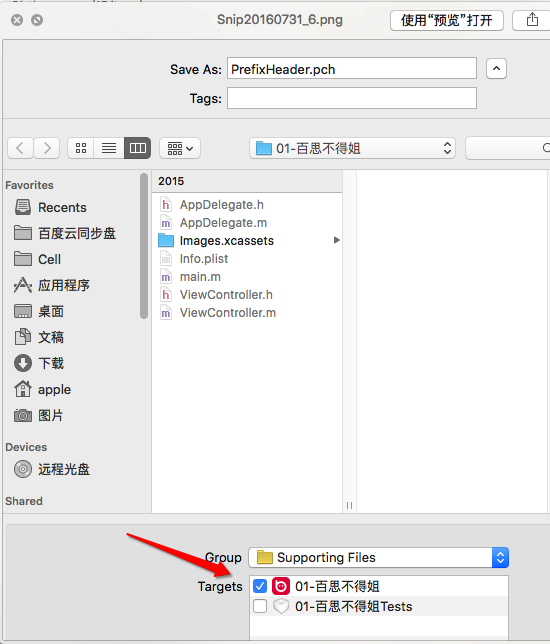
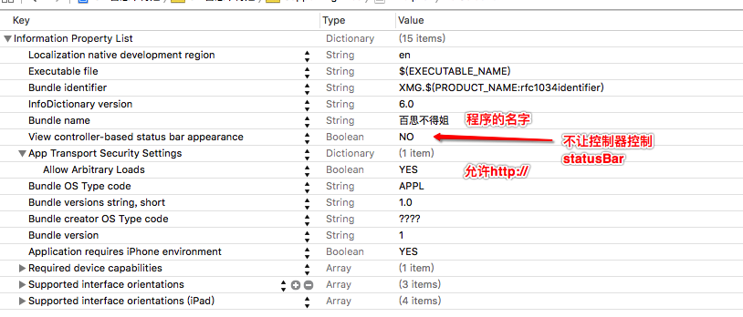
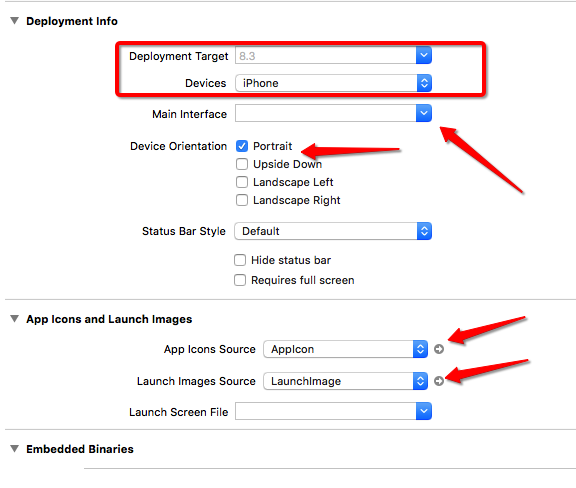

# basicSetting

## target里边配置pch





## 添加pch



## 设置程序的名字, 控制器不控制statusbar, 设置安全设置允许http://



## 设置版本, 运行设备, 横竖方向, app图片和启动图片



- 配置pch

```objc
#ifndef PrefixHeader_pch
#define PrefixHeader_pch
#ifdef __OBJC__

/**
 *  调试模式======================================
 */
#ifdef DEBUG

#define LMJLog(...) NSLog(__VA_ARGS__)

#else

#define LMJLog(...)

#endif


#import "UIView+LMJExtension.h"
#import "UIBarButtonItem+LMJExtension.h"
#import "UIImage+LMJImage.h"
#import "NSDate+LMJExtension.h"
#import "NSString+LMJExtension.h"
#import "UIImageView+LMJExtension.h"

/**
 *  储存工具类
 */
#import "LMJSaveTool.h"
/**
 *  常量
 */
#import "LMJConst.h"

/**
 *  打印函数
 */
#define LMJLogFunc LMJLog(@"%s", __func__)

/**
 *  全局view的背景色,
 */
#define LMJControllerViewBgColor LMJColorRBG(205, 205, 205, 1)

/** 系统相关 */
#define LMJNotiDefaultCenter [NSNotificationCenter defaultCenter]
#define LMJSharedApplication [UIApplication sharedApplication]
#define LMJKeyWindow ([UIApplication sharedApplication].keyWindow)
#define LMJMainBoundle [NSBundle mainBundle]
#define LMJMainScreen [UIScreen mainScreen]
#define LMJMainScreenHeight LMJMainScreen.bounds.size.height
#define LMJMainScreenWidth LMJMainScreen.bounds.size.width
#define LMJFileManager [NSFileManager defaultManager]
// ********************************************************************************

/**
 *  属性转字符串
 */
#define LMJKeyPath(obj, key) @(((void)obj.key, #key))

// 去除Xcode编译警告
//#pragma clang diagnostic push
// 方法过期警告
#pragma clang diagnostic ignored "-Wdeprecated-declarations"
//#pragma clang diagnostic pop


#endif
#endif

```
