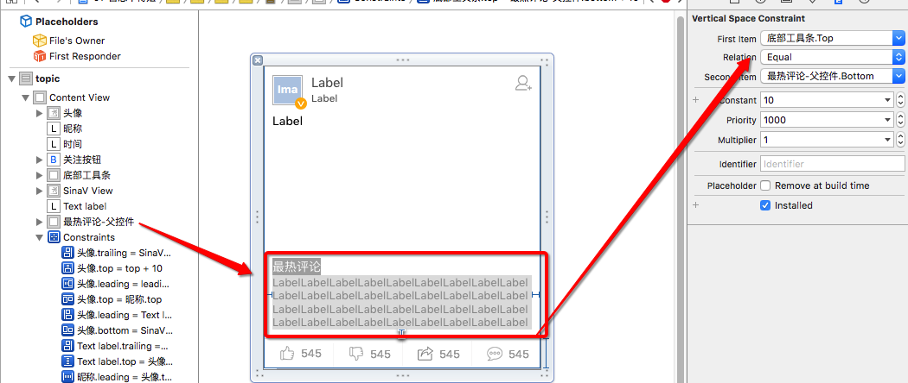
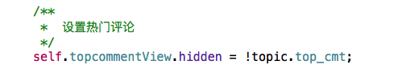
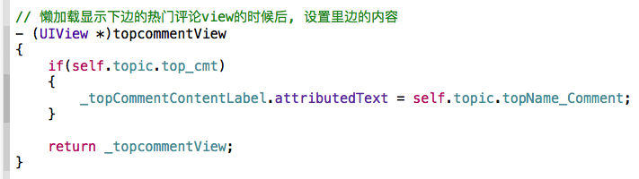

# hotComment




- 1, 在cell里边增加一个父控件, 里边放着热评的子控件label, 和其他的东西
    - 让热评控件的底部和按钮条的顶部有约束, 是热评控件能距离底部的间距不变

- 2, 在cell里边控制隐藏和设置数据


---


- 3, 设置评论的富文本`setAttributes`, 为模型增加一个热门评论的富文本字符串

```objc

- (NSAttributedString *)topName_Comment
{
    if(_topName_Comment == nil && self.top_cmt)
    {
        LMJComment *cmt = self.top_cmt;

        NSMutableDictionary *dict = [NSMutableDictionary dictionary];

        dict[NSForegroundColorAttributeName] = [UIColor blueColor];
//
//        NSMutableAttributedString *str = [[NSMutableAttributedString alloc] initWithString:[NSString stringWithFormat:@"%@: ", cmt.user.username] attributes:dict];
//        [str appendAttributedString:[[NSAttributedString alloc] initWithString:cmt.content]];
        NSString *str = [NSString stringWithFormat:@"%@: %@", cmt.user.username, cmt.content];
        NSMutableAttributedString *attStr = [[NSMutableAttributedString alloc] initWithString:str attributes:nil];


        [attStr setAttributes:dict range:NSMakeRange(0,[str rangeOfString:@":"].location+1)];

        _topName_Comment = attStr;
    }

    return _topName_Comment;
}

```

- 4, 转模型的时候如果数组里边存的是模型, 要告诉MJExtension
    - 或者用字典和数组去数据中去取

```objc
+ (NSDictionary *)mj_replacedKeyFromPropertyName
{
    return @{@"smallPicture" : @"image0",

             @"middlePicture" : @"image2",

             @"largePicture" : @"image1",

             @"voiceurl" : @"voiceuri",

             @"videourl" : @"videouri",

             @"ID" : @"id",
            // 指向取值
             @"top_cmt" : @"top_cmt[0]"
             };
}


// 评论数组转模型的告知
//+ (NSDictionary *)mj_objectClassInArray
//{
//    return @{
//             @"top_cmt" : NSStringFromClass([LMJComment class])
//             };
//


```

- 5, 在模型里边添加计算有热评数据的高度计算

```objc

- (CGFloat)cellHeight
{

    if(_cellHeight == 0)
    {
        // 先加到字体的Y第地方 + 内容距离底部条的间距+底部的条高度+cell内部减去的间距
        _cellHeight += LMJTopicCellTextLabelY + LMJTopicCellEdgeMargin + LMJTopicCellBottomBarHeight + LMJTopicCellEdgeMargin;

        // 计算里边   文字高度1+间距+图片2
//        CGFloat textLabelMaxWidth = LMJMainScreenWidth - 4 * LMJTopicCellEdgeMargin;

        CGFloat textLabelMaxWidth = LMJMainScreenWidth - 2 * LMJTopicCellEdgeMargin;

        CGFloat textLabelHeight = [self.text boundingRectWithSize:CGSizeMake(textLabelMaxWidth, MAXFLOAT) options:NSStringDrawingUsesLineFragmentOrigin attributes:@{NSFontAttributeName : [UIFont systemFontOfSize:14]} context:nil].size.height;

        // 加上文字的高度
        _cellHeight += textLabelHeight;

        /**如果不是文字cell, 就是其他的,
         */
//        self.height = 0;
        if(self.type != LMJTopicTypeWord && self.height != 0 && self.width != 0)
        {
#pragma mark - 如果不是文字=====================================================
            // 先把文字下边加上一个间距
            _cellHeight += LMJTopicCellEdgeMargin;

            /**
             *  无论是什么图片和声音和视频, 这几个都是固定的
             */
            CGFloat globalX = LMJTopicCellEdgeMargin;
            CGFloat globalY = LMJTopicCellTextLabelY + textLabelHeight + LMJTopicCellEdgeMargin;
            CGFloat globalW = textLabelMaxWidth;

#pragma mark  只用计算任何其他控件   的宽高和frame, 最后加上*******


                CGFloat pictureHeight = globalW * self.height / self.width;

            // 如果是图片, 就有可能过高, 其他控件设置frame的时候根本不会进来
                if(pictureHeight > LMJTopicCellPictureMaxHeight)
                {
                    pictureHeight = LMJTopicCellPictureBreakHeight;
                    _isBigPicture = YES;
                }

                // 计算图片的frame
                _pictureFrame = CGRectMake(globalX, globalY, globalW, pictureHeight);

                // 加上图片的高度
                _cellHeight += pictureHeight;


#pragma mark - 如果不是文字if结束===============================================
        }else
        {
            // 如果返回的图片的高度是0 , 就不计算, 并且设置type是文字类型
            self.type = LMJTopicTypeWord;
        }


        // 如果有热门评论
        if(self.top_cmt)
        {
            LMJComment *cmt = self.top_cmt;
            // 文字的高度加上3倍的间距

            // 文字的高度, 宽度比上边的正文内容少了2个间距
            CGFloat cmtWidth = textLabelMaxWidth - 2 * LMJTopicCellEdgeMargin;

            CGFloat cmtHeight = [[NSString stringWithFormat:@"%@: %@", cmt.user.username, cmt.content] boundingRectWithSize:CGSizeMake(cmtWidth, MAXFLOAT) options:NSStringDrawingUsesLineFragmentOrigin attributes:@{NSFontAttributeName : [UIFont systemFontOfSize:13]} context:nil].size.height;

            _cellHeight += cmtHeight + 3 * LMJTopicCellEdgeMargin;

        }

    }

    return _cellHeight;
}


```


