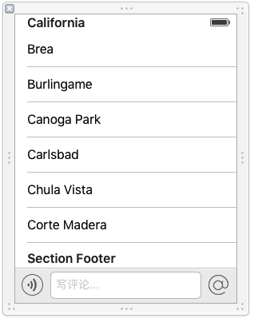
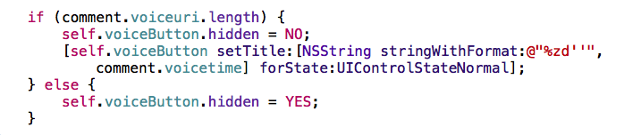
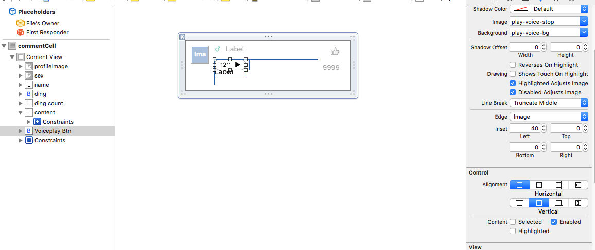

# LMJcommentVc




- 1, 根据帖子的ID去加载评论数据
- 2, 拿到底部的约束, 注册键盘的弹出通知, 修改底部的约束的值**要立即强制更新**
    - 死的时候要移除通知

```objc

    // 键盘显示\隐藏完毕的frame
    CGRect frame = [note.userInfo[UIKeyboardFrameEndUserInfoKey] CGRectValue];
    // 修改底部约束
    self.bottomSapce.constant = XMGScreenH - frame.origin.y;
    // 动画时间
    CGFloat duration = [note.userInfo[UIKeyboardAnimationDurationUserInfoKey] doubleValue];
    // 动画 及时刷新
    [UIView animateWithDuration:duration animations:^{
        [self.view layoutIfNeeded];
    }];

- (void)dealloc
{
    [[NSNotificationCenter defaultCenter] removeObserver:self];
}
```

- 根据最新评论和最热评论的数组的长度, 返回每一组的数据

- 设置tableview的tableHeaderview的时候要把评论的最热评论的帖子topicCell,
    放到一个额外的View里边, 然后再给到tableHeaderview

- 设置sectionHeaderview的时候背景颜色不一样要自定义

```objc
@interface LMJCommentHeaderView ()
/** uilabel */
@property (weak, nonatomic) UILabel *label;
@end

@implementation LMJCommentHeaderView

+ (instancetype)commentHeaderViewWithTableView:(UITableView *)tableView
{
    static NSString *const ID = @"headerfooterheader";

    LMJCommentHeaderView *header = [tableView dequeueReusableHeaderFooterViewWithIdentifier:ID];
    if (header == nil) {

        header = [[LMJCommentHeaderView alloc] initWithReuseIdentifier:ID];
    }

    return header;
}

// 在里边添加一个label, 并且设置字体颜色
- (instancetype)initWithReuseIdentifier:(NSString *)reuseIdentifier
{
    if(self = [super initWithReuseIdentifier:reuseIdentifier])
    {
        self.contentView.backgroundColor = LMJControllerViewBgColor;
        UILabel *label = [[UILabel alloc] init];
        label.textColor = LMJColorRBG(67, 67, 67, 1);
        [self.contentView addSubview:label];

        self.label = label;
    }
    return self;
}

- (void)layoutSubviews
{
    [super layoutSubviews];

    self.label.frame = self.contentView.bounds;
    self.label.x = LMJTopicCellEdgeMargin;

}

- (void)setTitle:(NSString *)title
{
    _title = title.copy;

    self.label.text = _title;
}

@end

```

- 在评论的头部中的帖子中, 如果有热评就不显示了
    - 为了解决这个问题, 在设置设置头部视图数据的时候,
    - 1, 先把热门评论保存起来
    - 2, 把模型中的热门评论给为nil, 把模型中的高度清零
    - 3, 再从模型拿高度的时候就会重新计算没有热评的高度
    - 4, 但是要在控制器死的时候把模型的热评数据还原, 并且把高度再次清零
    - 5, 这样下一次在去拿高度的时候, 模型中的cellHeight又会计算带有热评的高度

```objc
- (void)setupHeaderView
{
    if(self.topic.top_cmt)
    {
        self.top_cmt_save = self.topic.top_cmt;
        self.topic.top_cmt = nil;
        [self.topic setValue:@0 forKeyPath:LMJKeyPath(self.topic, cellHeight)];
    }

    UIView *header = [[UIView alloc] init];
//    header.backgroundColor = [UIColor clearColor];
    // 清零后, 会在这一步从新计算cell高度
    header.height = self.topic.cellHeight + LMJTopicCellEdgeMargin;

    LMJTopicCell *cell = [LMJTopicCell topicCellWithTableView:nil];
    cell.topic = self.topic;
    cell.frame = CGRectMake(0, 0, LMJMainScreenWidth, self.topic.cellHeight);

    [header addSubview:cell];
    self.tableView.tableHeaderView = header;
}

/**
 *  移除通知的监听
 */
- (void)dealloc
{
//    [self.manager.operationQueue cancelAllOperations];
//    [self.manager invalidateSessionCancelingTasks:YES];
    self.params = nil;

    [[NSNotificationCenter defaultCenter] removeObserver:self];

    // 如果保存了热评数组, 就还原之前模型的热评数组
    if(self.top_cmt_save)
    {
        self.topic.top_cmt = self.top_cmt_save;

        [self.topic setValue:@0 forKeyPath:LMJKeyPath(self.topic, cellHeight)];

        // 重新计算
//        [self.topic cellHeight];
    }
}

```

###commentCell

- 设置声音控件的隐藏与否的时候一定要用voiceuri的长度来判断, - 虽然没有长度, 但是服务器有可能返回一个空格字符串



- 要设置里边文字评论内容的label的最小高度
- 否则声音的按钮评论会接触到cell里边的底部
- 并且声音的按钮里边的图片可以直接通过右边的属性框中的edgeInset设置




- 在tableview里边用的时候可以让tableview自动计算cell的高度

```objc
    // 自动计算高度
    self.tableView.estimatedRowHeight = 44;
    self.tableView.rowHeight = UITableViewAutomaticDimension;

```


