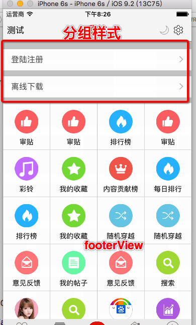

# LMJMeVc



- 默认的分组样式中每一组的间距不不合适, 可以通过代码调整

```objc

    // 调整header和footer
    self.tableView.sectionHeaderHeight = 0;
    self.tableView.sectionFooterHeight = XMGTopicCellMargin;

    // 调整inset
    self.tableView.contentInset = UIEdgeInsetsMake(XMGTopicCellMargin - 35, 0, 0, 0);

    // 设置footerView
    self.tableView.tableFooterView = [[XMGMeFooterView alloc] init];

```

- 在子控件中拿到导航控制器
- UITabBarVc里边有2个重要的属性,
    - `tabBarVc.selectedViewController`
    - `tabBarVc.selectedIndex`

```objc

    // 取出当前的导航控制器
    UITabBarController *tabBarVc = (UITabBarController *)
    [UIApplication sharedApplication].keyWindow.rootViewController;

    UINavigationController *nav = (UINavigationController *)tabBarVc.selectedViewController;

    [nav pushViewController:web animated:YES];

```


- webViewVc里边的加载进度都是虚拟的
- 一般用`NJKWebViewProgress`框架, 它里边有个代理回调, 首先NJKWebViewProgress成为webView的代理
- 然后控制器成为NJKWebViewProgress的代理, 那么当NJKWebViewProgress监听到webView的变化后
- NJKWebViewProgress又通知它自己的代理, 就这样解决了多个代理的问题

```objc
#import <NJKWebViewProgress.h>

    self.NJ_progress = [[NJKWebViewProgress alloc] init];
    // webview的代理设置为njprogress
    self.webView.delegate = self.NJ_progress;

    // 让njprogress通知外界, 调用外界的webview的代理方法,
    self.NJ_progress.webViewProxyDelegate = self;

    __weak typeof(self) weakSelf = self;
    self.NJ_progress.progressBlock = ^(float pro){
        weakSelf.progressView.hidden = (pro == 1);
        weakSelf.progressView.progress = pro;
//        LMJLog(@"%f", pro);
    };

```


