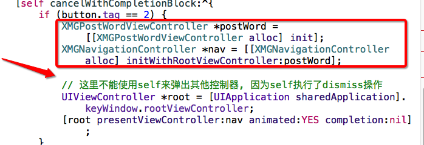
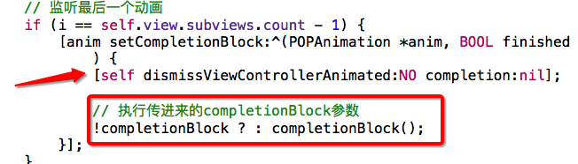

# LMJPublishVc

- 从发布界面跳转到发段子控制器界面的注意点



---




### 进入发段子控制器后

- 1, 右上角的按钮明明设置了不能点击,为什么不显示灰色呢?
    - 需要立即刷新布局`layoutIfNeeded`
    - setNeedsDisplay方法 : 会在恰当的时刻自动调用drawRect:方法
    * setNeedsLayout方法 : 会在恰当的时刻调用layoutSubviews方法
    * layoutIfNeeded方法,: 会立即刷新界面

```objc

    // 这一步的效果并不会立即展示, 下一步强制刷新
    self.navigationItem.rightBarButtonItem.enabled = NO;

    // 上一步设置不会立即生效, 要强制刷新界面
    [self.navigationController.navigationBar layoutIfNeeded];

    // 下一个运行循环刷新, 并且调用layoutsubviews
//    [self setNeedsLayout];
    // 马上刷新界面
    //    [self layoutIfNeeded];
    // 调用drawrect
    //    [self setNeedsDisplay];

```

- 2, UITextField *textField默认的情况
    - 1.只能显示一行文字
    - 2.有占位文字

    - UITextView *textView默认的情况
        - 2.能显示任意行文字
        - 2.没有占位文字

    - 文本输入控件,最终希望拥有的功能
        - 1.能显示任意行文字
        - 2.有占位文字

    - 最终的方案:
        - 1.继承自UITextView
        - 2.在UITextView能显示任意行文字的基础上,增加"有占位文字"的功能

- 3,在UITextView能显示任意行文字的基础上,增加"有占位文字"的功能,用`-drawRect`绘制文字
    - 用这种方式画上去的文字不会随着textView`self.alwaysBounceVertical = YES;`滚动
    - 要重写一大堆settter方法, 监听外界的自定义占位文字
        - 还要监听外界textfiled的一些属性变化
        - 在初始化的时候要有默认子占位文字颜色和字体

```objc
#import <UIKit/UIKit.h>

@interface XMGPlaceholderTextView : UITextView
/** 占位文字 */
@property (nonatomic, copy) NSString *placeholder;
/** 占位文字的颜色 */
@property (nonatomic, strong) UIColor *placeholderColor;
@end

#import "XMGPlaceholderTextView.h"

@implementation XMGPlaceholderTextView

- (instancetype)initWithFrame:(CGRect)frame
{
    if (self = [super initWithFrame:frame]) {
        // 垂直方向上永远有弹簧效果
        self.alwaysBounceVertical = YES;

        // 默认字体
        self.font = [UIFont systemFontOfSize:15];

        // 默认的占位文字颜色
        self.placeholderColor = [UIColor grayColor];

        // 监听文字改变
        [[NSNotificationCenter defaultCenter] addObserver:self selector:@selector(textDidChange) name:UITextViewTextDidChangeNotification object:nil];
    }
    return self;
}

- (void)dealloc
{
    [[NSNotificationCenter defaultCenter] removeObserver:self];
}

/**
 * 监听文字改变
 */
- (void)textDidChange
{
    [self setNeedsDisplay];
}

/**
 * 绘制占位文字(每次drawRect:之前, 会自动清除掉之前绘制的内容)
 */
- (void)drawRect:(CGRect)rect {
    // 如果有文字, 直接返回, 不绘制占位文字
//    if (self.text.length || self.attributedText.length) return;
    if (self.hasText) return;

    // 处理rect
    rect.origin.x = 4;
    rect.origin.y = 7;
    rect.size.width -= 2 * rect.origin.x;

    // 文字属性
    NSMutableDictionary *attrs = [NSMutableDictionary dictionary];
    attrs[NSFontAttributeName] = self.font;
    attrs[NSForegroundColorAttributeName] = self.placeholderColor;
    [self.placeholder drawInRect:rect withAttributes:attrs];
}

#pragma mark - 重写setter
- (void)setPlaceholderColor:(UIColor *)placeholderColor
{
    _placeholderColor = placeholderColor;

    [self setNeedsDisplay];
}

- (void)setPlaceholder:(NSString *)placeholder
{
    _placeholder = [placeholder copy];

    [self setNeedsDisplay];
}

- (void)setFont:(UIFont *)font
{
    [super setFont:font];

    [self setNeedsDisplay];
}

- (void)setText:(NSString *)text
{
    [super setText:text];

    [self setNeedsDisplay];
}

- (void)setAttributedText:(NSAttributedString *)attributedText
{
    [super setAttributedText:attributedText];

    [self setNeedsDisplay];
}

@end


```


### 用label当做textview的占位文字, 当占位文字发生改变的时候, 要立即刷新label,

```objc

/**
 *  懒加载label
 */
- (UILabel *)placeHolderLabel
{
    if(_placeHolderLabel == nil)
    {
        UILabel *placeHolderLabel = [[UILabel alloc] init];

        placeHolderLabel.x = 3;
        placeHolderLabel.y = 8;
        // 设置换行
        placeHolderLabel.numberOfLines = 0;
        [self addSubview:placeHolderLabel];
        self.placeHolderLabel = placeHolderLabel;

    }
    return _placeHolderLabel;
}

- (instancetype)initWithFrame:(CGRect)frame
{
    self = [super initWithFrame:frame];
    if (self) {
        // 设置textview上下滚动
        self.alwaysBounceVertical = YES;

        // 默认的颜色是灰色
        self.placeHolderColor=  [UIColor grayColor];
        self.font = [UIFont systemFontOfSize:15];

        [LMJNotiDefaultCenter addObserver:self selector:@selector(textChange:) name:UITextViewTextDidChangeNotification object:self];

    }
    return self;
}


- (void)layoutSubviews
{
    [super layoutSubviews];

    // 重新计算label的宽度
    self.placeHolderLabel.width = self.width - self.placeHolderLabel.x * 2;
    // 自适应调整高度
    [self.placeHolderLabel sizeToFit];
}

- (void)textChange:(NSNotification *)noti
{
    self.placeHolderLabel.hidden = self.hasText;

}

/**
 *  更新label的所有内容和尺寸
 */
- (void)updatePlaceHolderLabelFrame
{
    self.placeHolderLabel.font = self.font;
    self.placeHolderLabel.textColor = self.placeHolderColor;
    self.placeHolderLabel.text = _placeHolder;
    [self setNeedsLayout];
//    [self layoutIfNeeded];
//    [self setNeedsDisplay];
}

#pragma mark - 重写setter

- (void)setPlaceHolder:(NSString *)placeHolder
{
    _placeHolder = placeHolder.copy;
    [self updatePlaceHolderLabelFrame];
}

- (void)setPlaceHolderColor:(UIColor *)placeHolderColor
{
    _placeHolderColor = placeHolderColor.copy;
    [self updatePlaceHolderLabelFrame];

}

- (void)setFont:(UIFont *)font
{
    [super setFont:font];
    [self updatePlaceHolderLabelFrame];
}

- (void)setText:(NSString *)text
{
    [super setText:text];
    [self textChange:nil];
}

- (void)setAttributedText:(NSAttributedString *)attributedText
{
    [super setAttributedText:attributedText];
    [self textChange:nil];
}

- (void)dealloc
{
    [LMJNotiDefaultCenter removeObserver:self];
}

```


