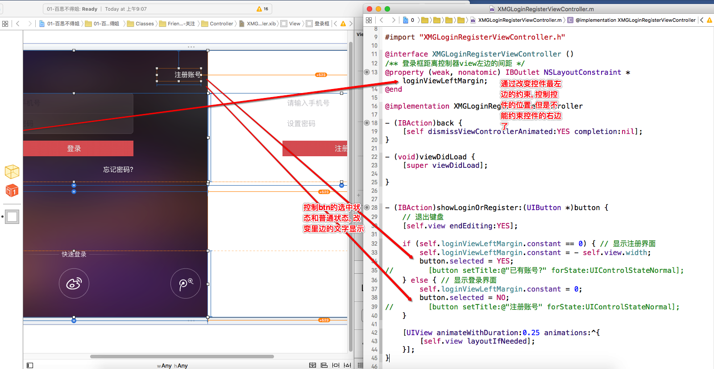

# 登陆运行时textfiled-超出屏幕的frame设置

- 运行时(Runtime):
    * 苹果官方一套C语言库
    * 能做很多底层操作(比如访问隐藏的一些成员变量\成员方法....)


###直接在右边属性框里边设置控件的一些属性


- 1, 设置富文本的富文本范围
    - 设置textFiled的占位文字颜色1

```objc

    // 设置富文本的富文本范围
    NSMutableAttributedString *placehoder = [[NSMutableAttributedString alloc] initWithString:@"手机号"];

    [placehoder setAttributes:@{NSForegroundColorAttributeName : [UIColor whiteColor]}
    range:NSMakeRange(0, 1)];

    [placehoder setAttributes:@{
                                NSForegroundColorAttributeName : [UIColor yellowColor],
                                NSFontAttributeName : [UIFont systemFontOfSize:30]
                                } range:NSMakeRange(1, 1)];
    [placehoder setAttributes:@{NSForegroundColorAttributeName : [UIColor redColor]}
    range:NSMakeRange(2, 1)];


```

- 2, 设置textFiled的占位文字颜色2

```objc
#import "XMGTextField.h"

@implementation XMGTextField

- (void)drawPlaceholderInRect:(CGRect)rect
{
    [self.placeholder drawInRect:CGRectMake(0, 10, rect.size.width, 25) withAttributes:@{NSForegroundColorAttributeName : [UIColor redColor],NSFontAttributeName : self.font}];
}

@end

```

- 3, 获得类对象的属性列表`getProperties`, **记得最后要free()**

```objc

+ (void)getProperties
{
    unsigned int count = 0;

    objc_property_t *properties = class_copyPropertyList([UITextField class], &count);

    for (int i = 0; i<count; i++) {
        // 取出属性
        objc_property_t property = properties[i];

        // 打印属性名字
        XMGLog(@"%s   <---->   %s", property_getName(property), property_getAttributes(property));
    }

    free(properties);
}

```

- 4, 拷贝出所有的成员变量列表getIvars, 记得最后要free()

```objc

+ (void)getIvars
{
    unsigned int count = 0;

    // 拷贝出所有的成员变量列表
    Ivar *ivars = class_copyIvarList([UITextField class], &count);

    for (int i = 0; i<count; i++) {
        // 取出成员变量
        //        Ivar ivar = *(ivars + i);
        Ivar ivar = ivars[i];

        // 打印成员变量名字
        XMGLog(@"%s %s", ivar_getName(ivar), ivar_getTypeEncoding(ivar));
    }

    // 释放
    free(ivars);
}

```

- 5, 通过kvc(通过运行时取textfiled里边的成员变量)设置文本框的占位文字的颜色, 同时还要监听textfiled的聚焦

```objc

- (void)awakeFromNib
{
//    UILabel *placeholderLabel = [self valueForKeyPath:@"_placeholderLabel"];
//    placeholderLabel.textColor = [UIColor redColor];

//    // 修改占位文字颜色
//    [self setValue:[UIColor grayColor] forKeyPath:@"_placeholderLabel.textColor"];

    // 设置光标颜色和文字颜色一致
    self.tintColor = self.textColor;

    // 不成为第一响应者
    [self resignFirstResponder];
}

/**
 * 当前文本框聚焦时就会调用
 */
- (BOOL)becomeFirstResponder
{
    // 修改占位文字颜色
    [self setValue:self.textColor forKeyPath:XMGPlacerholderColorKeyPath];
    return [super becomeFirstResponder];
}

/**
 * 当前文本框失去焦点时就会调用
 */
- (BOOL)resignFirstResponder
{
    // 修改占位文字颜色
    [self setValue:[UIColor grayColor] forKeyPath:XMGPlacerholderColorKeyPath];
    return [super resignFirstResponder];
}

```

- 6, 控制控件的约束, 来调整控件的位置
    - 更改约束后要调用`[self.view layoutIfNeeded]`控件才能调整位置



## 修改UITextField的placeholder颜色
- 使用属性

```objc
@property(nonatomic,copy)   NSAttributedString     *attributedPlaceholder;

// 文字属性
NSMutableDictionary *attrs = [NSMutableDictionary dictionary];
attrs[NSForegroundColorAttributeName] = [UIColor grayColor];

// NSAttributedString : 带有属性的文字(富文本技术)
NSAttributedString *placeholder = [[NSAttributedString alloc] initWithString:@"手机号" attributes:attrs];
self.phoneField.attributedPlaceholder = placeholder;

NSMutableAttributedString *placehoder = [[NSMutableAttributedString alloc] initWithString:@"手机号"];
[placehoder setAttributes:@{NSForegroundColorAttributeName : [UIColor whiteColor]} range:NSMakeRange(0, 1)];
[placehoder setAttributes:@{
                            NSForegroundColorAttributeName : [UIColor yellowColor],
                            NSFontAttributeName : [UIFont systemFontOfSize:30]
                            } range:NSMakeRange(1, 1)];
[placehoder setAttributes:@{NSForegroundColorAttributeName : [UIColor redColor]} range:NSMakeRange(2, 1)];
self.phoneField.attributedPlaceholder = placehoder;
```

- 重写方法

```objc
- (void)drawPlaceholderInRect:(CGRect)rect
{
    [self.placeholder drawInRect:CGRectMake(0, 10, rect.size.width, 25) withAttributes:@{
                                                       NSForegroundColorAttributeName : [UIColor grayColor],
                                                       NSFontAttributeName : self.font}];
}
```

- 使用KVC

```objc
[self setValue:[UIColor grayColor] forKeyPath:@"_placeholderLabel.textColor"];
```

## 运行时(Runtime)
- 苹果官方一套C语言库
- 能做很多底层操作(比如访问隐藏的一些成员变量\成员方法....)
- 访问成员变量举例

```objc
unsigned int count = 0;

// 拷贝出所有的成员变量列表
Ivar *ivars = class_copyIvarList([UITextField class], &count);

for (int i = 0; i<count; i++) {
    // 取出成员变量
    // Ivar ivar = *(ivars + i);
    Ivar ivar = ivars[i];

    // 打印成员变量名字
    XMGLog(@"%s", ivar_getName(ivar));
}

// 释放
free(ivars);
```


