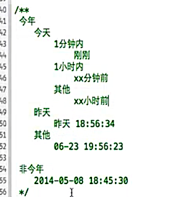

# LMJTopicCell- 的完善过程

- 1, 加载基本数据, 不加载内容
    -  加载cell的时候重写setFrame方法,


- 2, 时间处理`[NSCalendar currentCalendar]`

```objc


#import "NSDate+LMJExtension.h"

@implementation NSDate (LMJExtension)

// 比较2个时间的差值,
+ (NSDateComponents *)dateFromStringDate:(NSString *)dateStr withDateStrFormat:(NSString *)format toDate:(NSDate *)date
{

    NSDateFormatter *fmt = [[NSDateFormatter alloc] init];
    fmt.dateFormat = format;

    NSDate *fromDate = [fmt dateFromString:dateStr];


    NSCalendarUnit unit = NSCalendarUnitYear | NSCalendarUnitMonth | NSCalendarUnitDay | NSCalendarUnitHour | NSCalendarUnitMinute | NSCalendarUnitSecond;


    return [[NSCalendar currentCalendar] components:unit fromDate:fromDate toDate:date options:0];
}

// 根据一个字符串返回一个时间
+ (instancetype)dateFromStringDate:(NSString *)dateStr withDateStrFormat:(NSString *)format
{
    NSDateFormatter *fmt = [[NSDateFormatter alloc] init];
    fmt.dateFormat = format;

    return [fmt dateFromString:dateStr];
}

// 根据一个时间, 返回一个字符串
+ (NSString *)dateStringFromDate:(NSDate *)date
{
    NSDateFormatter *fmt = [[NSDateFormatter alloc] init];
    fmt.dateFormat = LMJDateStringFormat;

    return [fmt stringFromDate:date];

}

- (BOOL)isThisYear
{
    NSCalendar *calendar = [NSCalendar currentCalendar];

    NSCalendarUnit unit = NSCalendarUnitYear;

    NSInteger nowYear = [calendar component:unit fromDate:[NSDate date]];

    NSInteger fromYear = [calendar component:unit fromDate:self];

    return nowYear == fromYear;
}

- (BOOL)isToday
{
    NSDateFormatter *fmt = [[NSDateFormatter alloc] init];
    fmt.dateFormat = @"yyyy:MM:dd";


    NSString *fromDateStr = [fmt stringFromDate:self];
    NSString *nowDateStr = [fmt stringFromDate:[NSDate date]];

    return [fromDateStr isEqualToString:nowDateStr];
}

- (BOOL)isYeaterday
{
    NSDateFormatter *fmt = [[NSDateFormatter alloc] init];
    fmt.dateFormat = @"yyyy:MM:dd";

    NSDate *fromDate = [fmt dateFromString:[fmt stringFromDate:self]];
    NSDate *nowDate = [fmt dateFromString:[fmt stringFromDate:[NSDate date]]];


    NSCalendarUnit unit = NSCalendarUnitYear | NSCalendarUnitMonth | NSCalendarUnitDay;

   NSDateComponents *cmps = [[NSCalendar currentCalendar] components:unit fromDate:fromDate toDate:nowDate options:0];

    return (cmps.year == 0 && cmps.month == 0 && cmps.day == 1);
}

- (BOOL)isInAnHour
{
    if([self isToday])
    {
        NSCalendarUnit unit = NSCalendarUnitHour | NSCalendarUnitMinute;

        NSDateComponents *cmps = [[NSCalendar currentCalendar] components:unit fromDate:self toDate:[NSDate date] options:0];

        return (cmps.hour == 0);

    }else
    {
        return NO;
    }
}

- (BOOL)isInOneMinute
{
    if([self isInAnHour])
    {
        NSCalendarUnit unit = NSCalendarUnitMinute | NSCalendarUnitSecond;

        NSDateComponents *cmps = [[NSCalendar currentCalendar] components:unit fromDate:self toDate:[NSDate date] options:0];

        return (cmps.minute == 0);

    }else
    {
        return NO;
    }

}


@end

```

- 2.1 时间处理, 获取和现在时间的差值, 获取一个时间各个部分组成.

```objc
- (void)testDate:(NSString *)create_time
{
    // 日期格式化类
    NSDateFormatter *fmt = [[NSDateFormatter alloc] init];
    // 设置日期格式(y:年,M:月,d:日,H:时,m:分,s:秒)
    fmt.dateFormat = @"yyyy-MM-dd HH:mm:ss";

    // 当前时间
    NSDate *now = [NSDate date];
    // 发帖时间
    NSDate *create = [fmt dateFromString:create_time];

    XMGLog(@"%@", [now deltaFrom:create]);

    // 日历
    NSCalendar *calendar = [NSCalendar currentCalendar];

    // 比较时间
    NSCalendarUnit unit = NSCalendarUnitDay | NSCalendarUnitMonth | NSCalendarUnitYear | NSCalendarUnitHour | NSCalendarUnitMinute | NSCalendarUnitSecond;
    NSDateComponents *cmps = [calendar components:unit fromDate:create toDate:now options:0];

    XMGLog(@"%@ %@", create, now);
    XMGLog(@"%zd %zd %zd %zd %zd %zd", cmps.year, cmps.month, cmps.day, cmps.hour, cmps.minute, cmps.second);

     //获得NSDate的每一个元素
    NSInteger year = [calendar component:NSCalendarUnitYear fromDate:now];
    NSInteger month = [calendar component:NSCalendarUnitMonth fromDate:now];
    NSInteger day = [calendar component:NSCalendarUnitDay fromDate:now];
    NSDateComponents *cmps = [calendar components:NSCalendarUnitDay | NSCalendarUnitMonth | NSCalendarUnitYear fromDate:now];
    XMGLog(@"%zd %zd %zd", cmps.year, cmps.month, cmps.day);
}

- (void)testDate:(NSString *)create_time
{
    // 当前时间
    NSDate *now = [NSDate date];

    // 发帖时间
    NSDateFormatter *fmt = [[NSDateFormatter alloc] init];
    // 设置日期格式(y:年,M:月,d:日,H:时,m:分,s:秒)
    fmt.dateFormat = @"yyyy-MM-dd HH:mm:ss";
    NSDate *create = [fmt dateFromString:create_time];
    NSTimeInterval delta = [now timeIntervalSinceDate:create];
}

```

- 3, 处理服务器返回的时间格式化显示, 重写LMJTopic里边的时间的getter方法




```objc

- (NSString *)created_at
{
    NSDate *creatDate = [NSDate dateFromStringDate:_created_at withDateStrFormat:LMJDateStringFormat];


    NSDateComponents *cmps = [NSDate dateFromStringDate:_created_at withDateStrFormat:LMJDateStringFormat toDate:[NSDate date]];

    NSDateFormatter *fmt = [[NSDateFormatter alloc] init];

    if([creatDate isInOneMinute])
    {
        return @"刚刚";
    }else if ([creatDate isInAnHour])
    {
        return [NSString stringWithFormat:@"%zd分钟前", cmps.minute];
    }else if ([creatDate isToday])
    {
        return [NSString stringWithFormat:@"%zd小时前", cmps.hour];
    }else if ([creatDate isYeaterday])
    {
        fmt.dateFormat = @"昨天 HH:mm:ss";
        return [fmt stringFromDate:creatDate];
    }else if ([creatDate isThisYear])
    {
        fmt.dateFormat = @"MM-dd HH:mm:ss";
        return [fmt stringFromDate:creatDate];
    }else
    {
        return _created_at;
    }

}

```


- 4, 加V显示
    - 直接在头像下边增加一个imageView, 根据服务器的数据判断显示与否

- 5, 重构LMJTopicVc, 在精华控制器中添加子控制器的时候,
    - 设置子控制器的topic类型,自控制器根据类型去加载数据
