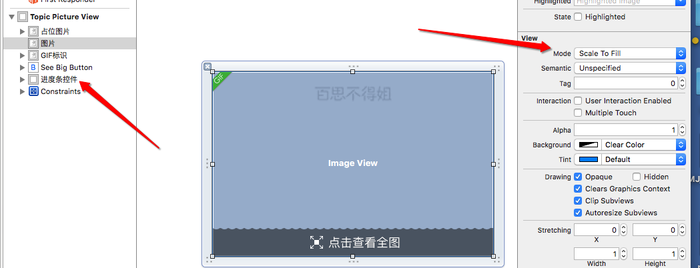

# LMJTopicPictureView



- 因为在计算图片控件的高度的时候, 设置了最大的高度, 所以大图片不安
    比例缩放的时候会很难看
- 根据是不是大图, 控制下边按钮的显示与否,
- 左上角的gif也是根据服务器返回的是不是gif控制隐藏与否


- 几种图片的格式, 图片的压缩难看通过改变imageView的内容模式来修改

```objc

     UIViewContentModeScaleToFill, // 把图片的长宽拉伸和控件的长宽一样
     UIViewContentModeScaleAspectFit,      // 把控件的宽度填满, 图片长度按比例缩放
     UIViewContentModeScaleAspectFill,     // 把控件的高度填满, 图片的宽度按比例缩放
     UIViewContentModeRedraw,              // 把图片的长宽拉伸和控件的长宽一样
     UIViewContentModeCenter,              //, 仅仅是把图片放到中间, 图片的大小和尺寸不变

         // 判断是否显示"点击查看全图"
    if (topic.isBigPicture) { // 大图
        self.seeBigButton.hidden = NO;
        self.imageView.contentMode = UIViewContentModeScaleAspectFill;
    } else { // 非大图
        self.seeBigButton.hidden = YES;
        self.imageView.contentMode = UIViewContentModeScaleToFill;
    }
```

- 图片的后边有个下载进度圆圈, 使用`DACircularProgress`框架
- 在图片空间的后边直接添加一个view, 绑定类名就ok了
-  给图片添加tap手势,
-  如果给一个控件设置了`userInteractionEnabled== NO`的时候, 它默认会把时间向上传递来处理
- 为了防止太依赖第三方框架, 继承自DALabeledCircularProgressView, 冲写了setprogress方法

```objc
- (void)awakeFromNib
{
    self.roundedCorners = 2;
    self.progressLabel.textColor = [UIColor whiteColor];
}

- (void)setProgress:(CGFloat)progress animated:(BOOL)animated
{
    [super setProgress:progress animated:animated];

    NSString *text = [NSString stringWithFormat:@"%.0f%%", progress * 100];
    self.progressLabel.text = [text stringByReplacingOccurrencesOfString:@"-" withString:@""];
}

```

- 应为图片也是循环利用的, 所以在给图片控件传递模型后, 图片控件的下载进度会延缓, 为了解决这个问题
    - 给模型增加一个属性, 记录当前模型中图片的下载进度
    - 1每次给图片控件传递模型的时候都迅速设置进度
    - 2同时在设置进度的时候拿到当前的模型来设置进度`self.topic`
    - 3同时每次设置模型的时候, 都要看模型里边的进度值是否已经完成
        - 如果完成就要隐藏里边的进度控件
    - 4加载图片控件的时候, 它的尺可能不对这时候就要用到`self.autoresizingMask = UIViewAutoresizingNone;`

**以下代码每一个注释都很重要**

```objc

#import "LMJTopicPictureView.h"
#import <UIImageView+WebCache.h>
#import "LMJTopic.h"
#import "LMJProgressView.h"
#import "LMJShowBigPictureViewController.h"

@interface LMJTopicPictureView ()
@property (weak, nonatomic) IBOutlet UIImageView *pictureImageView;
@property (weak, nonatomic) IBOutlet UIImageView *gifFlagView;
@property (weak, nonatomic) IBOutlet UIButton *seeBigBtn;
@property (weak, nonatomic) IBOutlet LMJProgressView *progressView;

/** 通知modal出来的控制器, 我觉得进度发生了改变 */
//@property (nonatomic, copy) void(^progress)(CGFloat progress);
@end

@implementation LMJTopicPictureView

+ (instancetype)topicPictureView
{
    return [LMJMainBoundle loadNibNamed:NSStringFromClass(self) owner:nil options:nil].lastObject;
}

- (void)setTopic:(LMJTopic *)topic
{
    _topic = topic;

    // 1, 如果还没有下载完, 就显示控件
    self.progressView.hidden = (topic.progressDownLoad == 1);

    // 2, 立马显示最新的进度值(防止因为网速慢, 导致显示的是其他图片的下载进度)
    [self.progressView setProgress:topic.progressDownLoad animated:NO];

    //3,  当是gif图片的时候要隐藏gifView
//    self.gifFlagView.hidden = ![topic.largePicture.pathExtension.lowercaseString isEqualToString:@"gif"];
    self.gifFlagView.hidden = !topic.is_gif;

    // 4, 当是大图的时候就把下边的按钮隐藏
    self.seeBigBtn.hidden = !topic.isBigPicture;

    // 5当时大图的时候, 就不要缩放, 展示图片的一部分, 否则就缩放
//    self.pictureImageView.contentMode = topic.isBigPicture ? UIViewContentModeScaleAspectFill : UIViewContentModeScaleToFill;
//    if(topic.isBigPicture)
//    {
//        self.seeBigBtn.hidden = NO;
//        self.pictureImageView.contentMode = UIViewContentModeScaleAspectFill ;
//
//    }else
//    {
//        self.seeBigBtn.hidden = YES;
//
//        self.pictureImageView.contentMode = UIViewContentModeScaleToFill;
//    }


    // 下载处理
    [self.pictureImageView sd_setImageWithURL:[NSURL URLWithString:topic.largePicture] placeholderImage:nil options:0 progress:^(NSInteger receivedSize, NSInteger expectedSize) {

        topic.progressDownLoad = 1.0 * receivedSize / expectedSize;

//        if(self.topic == topic)
//        {
        // 6设置当前模型的下载进度, 不也if也可以, 当前cell的模型数据

#pragma mark - 注意点要用cell<当前模型>的数据进度
            [self.progressView setProgress:self.topic.progressDownLoad animated:NO];

//            if(self.progress)
//            {
//                self.progress(progress);
//            }
//        }


    } completed:^(UIImage *image, NSError *error, SDImageCacheType cacheType, NSURL *imageURL) {

        // 如果是大图片, 才需要绘图, 否则就是小图片和gif图片
        if(topic.isBigPicture == NO || self.gifFlagView.hidden == NO) return ;
        if (self.topic != topic) return;

        // 只要设置图片就会调用
        // 控制隐藏, 当是当前的模型的时候才隐藏
        dispatch_async(dispatch_get_global_queue(0, 0), ^{

            UIGraphicsBeginImageContextWithOptions(topic.pictureFrame.size, NO, 0);

            CGFloat w = topic.pictureFrame.size.width;


            CGFloat h = w * topic.height / topic.width;


            [image drawInRect:CGRectMake(0, 0, w, h)];

            UIImage *newImage = UIGraphicsGetImageFromCurrentImageContext();

            UIGraphicsEndImageContext();

            dispatch_async(dispatch_get_main_queue(), ^{

                self.pictureImageView.image = newImage;

            });

        });

    }];
}

- (void)awakeFromNib
{
    [super awakeFromNib];
    // 7 图片控件拉伸和难堪, 这个解决
    self.autoresizingMask = UIViewAutoresizingNone;
    self.pictureImageView.clipsToBounds = YES;

    // 8给图片添加点击事件
    self.pictureImageView.userInteractionEnabled = YES;
    [self.pictureImageView addGestureRecognizer:[[UITapGestureRecognizer alloc] initWithTarget:self action:@selector(showBigPicture)]];
}

/**
 *  显示大图的控制器
 */
- (void)showBigPicture
{
    LMJShowBigPictureViewController *showVc = [[LMJShowBigPictureViewController alloc] init];

    showVc.topic = self.topic;

    [LMJKeyWindow.rootViewController presentViewController:showVc animated:YES completion:nil];

    // 控制器一出来就要知道下载了多少!!!!


    // 通知外界我的进度发生了改变
//    [self setProgress:^(CGFloat progress) {
//
//        showVc.progress = progress;
//    }];
}

@end

```


## 显示大图的控制器

- 1里边的逻辑和上边的pictureView的逻辑一样

- 2怎么保存图片到相册?

```objc
    UIImageWriteToSavedPhotosAlbum(self.imageView.image,
    self, @selector(image:didFinishSavingWithError:contextInfo:), nil);


// 保存后调用
- (void)image:(UIImage *)image didFinishSavingWithError:(NSError *)error
contextInfo:(void *)contextInfo


```
- 3, 通过这2个方法控制状态条的颜色

```objc
// 控制状态条
- (void)viewWillDisappear:(BOOL)animated
{
    [super viewWillDisappear:animated];

    LMJSharedApplication.statusBarStyle = UIStatusBarStyleDefault;
}

- (void)viewWillAppear:(BOOL)animated
{
    [super viewWillAppear:animated];

    LMJSharedApplication.statusBarStyle = UIStatusBarStyleLightContent;
}

```

- 4给控制器的view添加一个手势, 当点击view的时候, 就dismiss
    - 当图片的尺寸超过屏幕尺寸的时候还需要滚动查看

```objc

@interface LMJShowBigPictureViewController ()<UIScrollViewDelegate>
@property (weak, nonatomic) IBOutlet UIScrollView *scrollView;
/**
 *  进度控件
 */
@property (weak, nonatomic) IBOutlet LMJProgressView *progressView;

/** 显示图片的控件 */
@property (weak, nonatomic) UIImageView *imageView;

/** 储存原始的imageView的高度 */
@property (assign, nonatomic) CGFloat imageViewHeight;

@end

@implementation LMJShowBigPictureViewController

- (void)viewDidLoad {
    [super viewDidLoad];

    // 如果还没有下载完, 就显示控件
//    if(self.topic.progressDownLoad < 1) self.progressView.hidden = NO;
    self.progressView.hidden = (self.topic.progressDownLoad == 1);

    // 一进来就设置最新的下载进度
    [self.progressView setProgress:self.topic.progressDownLoad animated:NO];

    // 设置放大缩小
    self.scrollView.delegate = self;
    // 设置scrollView的放大缩小比例
    self.scrollView.minimumZoomScale = 1;
    // 设置最大缩放比例
    CGFloat maximumZoomScale = self.topic.width / LMJMainScreenWidth;
    if(maximumZoomScale <= 1) maximumZoomScale = 1;
    self.scrollView.maximumZoomScale = maximumZoomScale;

    // 添加imageView
    UIImageView *imageView = [[UIImageView alloc] init];
    [self.scrollView addSubview:imageView];
    self.imageView = imageView;

    // 继续下载图片
    [self.imageView sd_setImageWithURL:[NSURL URLWithString:self.topic.largePicture] placeholderImage:nil options:0 progress:^(NSInteger receivedSize, NSInteger expectedSize) {

        // 模型里边的进度不断在改变
        [self.progressView setProgress:self.topic.progressDownLoad animated:NO];

    } completed:^(UIImage *image, NSError *error, SDImageCacheType cacheType, NSURL *imageURL) {

        // 下载完了就隐藏进度条
        self.progressView.hidden = YES;
    }];

    // 可以通过kvo监听模型里边的进度改变
//    [self.topic addObserver:self forKeyPath:LMJKeyPath(self.topic, progressDownLoad) options:NSKeyValueObservingOptionNew context:nil];


    // 设置可以交互
//    self.imageView.userInteractionEnabled = YES;
//    [self.imageView addGestureRecognizer:[[UITapGestureRecognizer alloc] initWithTarget:self action:@selector(dismiss)]];
    [self.view addGestureRecognizer:[[UITapGestureRecognizer alloc] initWithTarget:self action:@selector(dismiss)]];

    // 设置imageView的frame
    CGFloat imageViewWidth = LMJMainScreenWidth;
    CGFloat imageViewHeight = imageViewWidth * self.topic.height / self.topic.width;
    self.imageViewHeight = imageViewHeight;

    // size是固定的
    self.imageView.size = CGSizeMake(imageViewWidth, imageViewHeight);

    // 设置位置, 和scroll的contentsize
    if(imageViewHeight > LMJMainScreenHeight)
    {
        self.scrollView.contentSize = CGSizeMake(0, imageViewHeight);
    }else
    {
        self.imageView.centerY = LMJMainScreenHeight / 2;
    }


}


#pragma mark - <UIScrollViewDelegate>

- (UIView *)viewForZoomingInScrollView:(UIScrollView *)scrollView
{
    return self.imageView;
}

- (void)scrollViewDidZoom:(UIScrollView *)scrollView
{
    if(self.imageViewHeight <= LMJMainScreenHeight)
    {
        self.imageView.centerY = LMJMainScreenHeight / 2;
    }
}


#pragma mark - 监听模型里边的进度改变
//- (void)observeValueForKeyPath:(NSString *)keyPath ofObject:(id)object change:(NSDictionary<NSString *,id> *)change context:(void *)context
//{
////    LMJLog(@"keypath=%@,\n obj=%@, \n change = %@ ", keyPath, object, change);
//
//    [self.progressView setProgress:self.topic.progressDownLoad animated:NO];
//
////    if(self.topic.progressDownLoad == 1)
////    {
////        [self.imageView sd_setImageWithURL:[NSURL URLWithString:self.topic.largePicture]];
////    }
//}


// 保存图片
- (IBAction)savePicture {

    if(self.imageView.image == nil)
    {
        [SVProgressHUD showErrorWithStatus:@"图片没有下载完毕"];
        return;
    }

    UIImageWriteToSavedPhotosAlbum(self.imageView.image, self, @selector(image:didFinishSavingWithError:contextInfo:), nil);
}

// 保存后调用
- (void)image:(UIImage *)image didFinishSavingWithError:(NSError *)error contextInfo:(void *)contextInfo
{
    if(error)
    {
        [SVProgressHUD showErrorWithStatus:@"图片保存失败"];
    }else
    {
        [SVProgressHUD showSuccessWithStatus:@"图片保存成功"];
    }

    dispatch_after(dispatch_time(DISPATCH_TIME_NOW, (int64_t)(1 * NSEC_PER_SEC)), dispatch_get_main_queue(), ^{
        [SVProgressHUD dismiss];
    });

}

- (IBAction)dismiss
{
    [self dismissViewControllerAnimated:YES completion:nil];
}

// 重写setprogress方法, 知道外界的进度下载了多少
//- (void)setProgress:(CGFloat)progress
//{
//    _progress = progress;
//
//    [self.progressView setProgress:progress animated:NO];
//}

// 控制状态条
- (void)viewWillDisappear:(BOOL)animated
{
    [super viewWillDisappear:animated];

    LMJSharedApplication.statusBarStyle = UIStatusBarStyleDefault;
}

- (void)viewWillAppear:(BOOL)animated
{
    [super viewWillAppear:animated];

    LMJSharedApplication.statusBarStyle = UIStatusBarStyleLightContent;
}

@end

```


