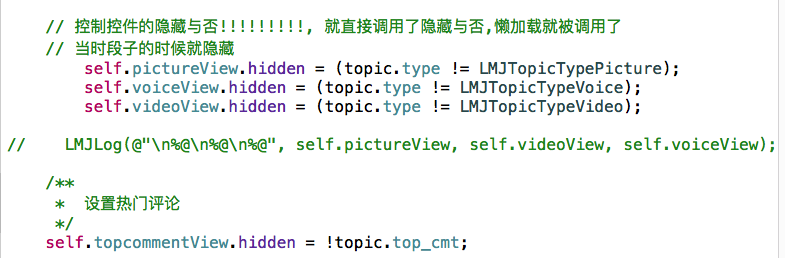
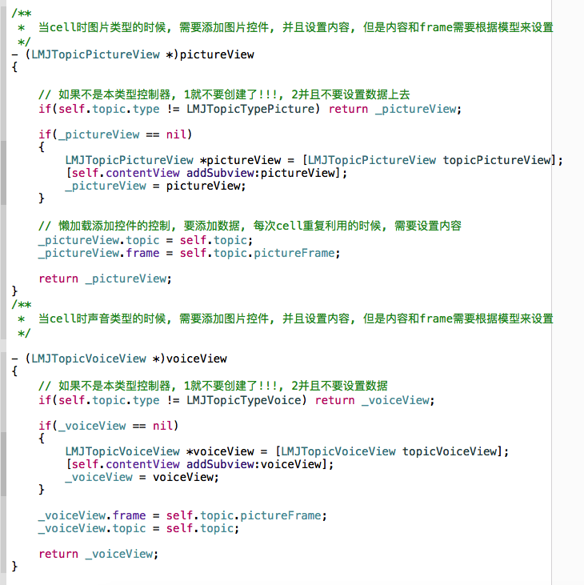
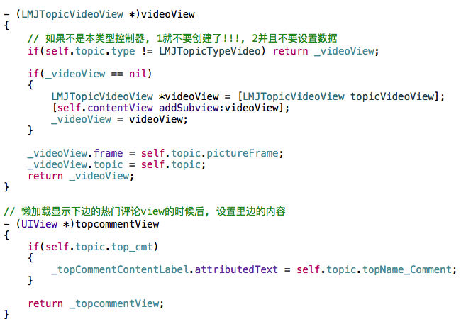
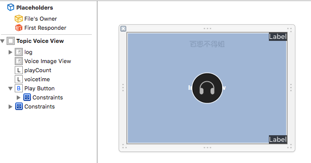

# LMJTopicVoice&VideoView

- 1, 相当于添加图片到cell的中间

- 2, 只不过要控制cell里边所有中间内容空间的隐藏与否
    - LMJTopicVc的数据类型是全部的时候, cell里边的所有的控件都会添加, 只不过要根据cell里边的真实的
        模型的类型, 控制中间控件的隐藏与否
    - 可以把每个控件的设置数据页写到懒加载里边
    - 为了性能着想, 当不是当前的帖子类型的时候, 就不需要创建其他的控件, 就直接不创建就行了
    - 如果是全部的类型, 就已经创建了中间所有的内容控件, 需要控制中中间的其他控件的隐藏与否
    - 中间的控件也是循环利用的要不停的设置frame和传递数据



---



---




### 图片或者视频控件的样子



```objc

#import "LMJTopicVideoView.h"
#import <UIImageView+WebCache.h>
#import "LMJTopic.h"
#import "LMJShowBigPictureViewController.h"
@interface LMJTopicVideoView ()
@property (weak, nonatomic) IBOutlet UIImageView *videoImageView;
@property (weak, nonatomic) IBOutlet UILabel *playCountLabel;
@property (weak, nonatomic) IBOutlet UILabel *videoTimeLabel;
@property (weak, nonatomic) IBOutlet UIButton *playButton;

@end

@implementation LMJTopicVideoView

+ (instancetype)topicVideoView
{
    return [LMJMainBoundle loadNibNamed:NSStringFromClass(self) owner:nil options:nil].lastObject;
}

- (void)awakeFromNib
{
    [super awakeFromNib];
    self.autoresizingMask = UIViewAutoresizingNone;
    self.videoImageView.clipsToBounds = YES;

    // 给图片添加点击事件
    self.videoImageView.userInteractionEnabled = YES;
    [self.videoImageView addGestureRecognizer:[[UITapGestureRecognizer alloc] initWithTarget:self action:@selector(showBigPicture)]];
}

- (void)setTopic:(LMJTopic *)topic
{
    _topic = topic;

    [self.videoImageView sd_setImageWithURL:[NSURL URLWithString:topic.largePicture]];

    self.playCountLabel.text = [NSString stringWithFormat:@"%zd播放", topic.playcount];

//    NSInteger minute = topic.videotime / 60;
//    NSInteger second = topic.videotime % 60;

    self.videoTimeLabel.text = [NSString stringWithTimeSeconds:topic.videotime];

}

- (void)showBigPicture
{
    LMJShowBigPictureViewController *showVc = [[LMJShowBigPictureViewController alloc] init];

    showVc.topic = self.topic;

    [LMJKeyWindow.rootViewController presentViewController:showVc animated:YES completion:nil];

    // 控制器一出来就要知道下载了多少!!!!


    // 通知外界我的进度发生了改变
    //    [self setProgress:^(CGFloat progress) {
    //
    //        showVc.progress = progress;
    //    }];
}

- (IBAction)playButtonClict:(UIButton *)sender {

}

@end

```
