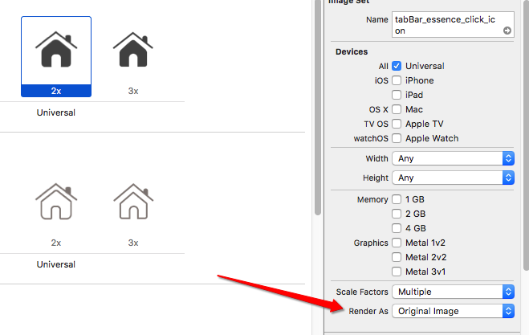

# setTabBar

```objc
    // 添加子控制器
    UIViewController *vc01 = [[UIViewController alloc] init];
    // 设置tabar上边的标题
    vc01.tabBarItem.title = @"精华";
    // 设置默认图片
    vc01.tabBarItem.image = [UIImage imageNamed:@"tabBar_essence_icon"];
    // 设置选中图片
    // 设置不同状态下的图片, 并且不让渲染
        UIImage *image = [UIImage imageNamed:@"tabBar_essence_click_icon"];
        image = [image imageWithRenderingMode:UIImageRenderingModeAlwaysOriginal];
        vc01.tabBarItem.selectedImage = image;
    // 设置不同tabaritem不同状态下的文字富文本属性
    NSMutableDictionary *attrs = [NSMutableDictionary dictionary];
    attrs[NSFontAttributeName] = [UIFont systemFontOfSize:12];
    attrs[NSForegroundColorAttributeName] = [UIColor grayColor];
    [vc01.tabBarItem setTitleTextAttributes:attrs forState:UIControlStateNormal];

    NSMutableDictionary *selectedAttrs = [NSMutableDictionary dictionary];
    selectedAttrs[NSFontAttributeName] = [UIFont systemFontOfSize:12];
    selectedAttrs[NSForegroundColorAttributeName] = [UIColor darkGrayColor];
    [vc01.tabBarItem setTitleTextAttributes:selectedAttrs forState:UIControlStateSelected];

```

### 直接在图片里边设置不渲染


