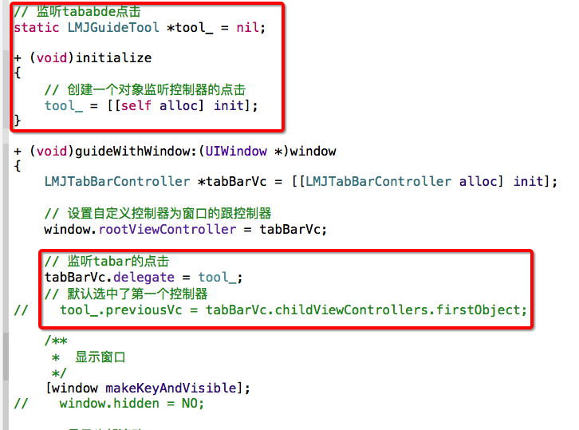
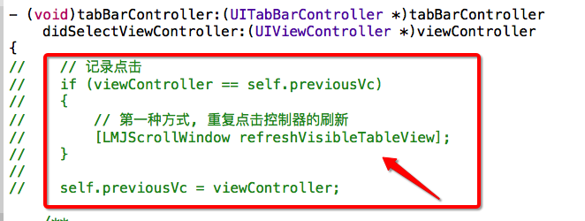
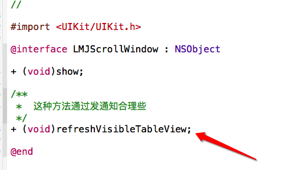
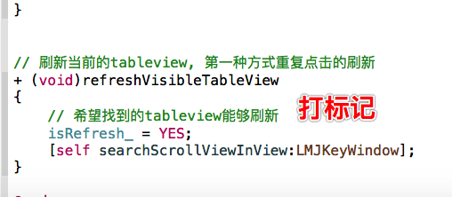
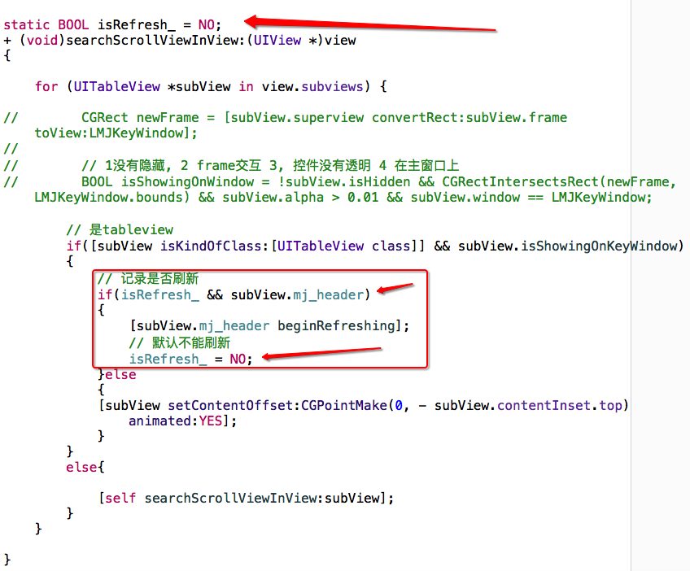

# tabBar-doubleClickToRefresh

###第一种方式发送通知

- 1, 当tabBar被点击的时候发出通知,

```objc
/**
 *  发通知给lmjtopicVc, 点击了tabar
 *
 *  @param selectedItem 选中了哪个item
 */
- (void)setSelectedItem:(UITabBarItem *)selectedItem
{
    [super setSelectedItem:selectedItem];


    NSDictionary *info = @{
                           LMJTabBarControllerDidSelectedIndex : @([self.items indexOfObject:selectedItem])
                           };

    [LMJNotiDefaultCenter postNotificationName:LMJTabBarControllerDidSelectedNotification object:nil userInfo:info];

}
```

- 2, 然后在LMJTopicVC里边监听通知, 如果发现自己所在的控制器的tabbarItem被重复点击, 就刷新自己的tabview

```objc
    //注册当tabarVC选中的时候时候发出的通知, 不需要接受数据
    [LMJNotiDefaultCenter addObserver:self selector:@selector(tabBarClick:) name:LMJTabBarControllerDidSelectedNotification object:nil];

// 选中了tabar的时候的通知调用
- (void)tabBarClick:(NSNotification *)noti
{
    /**
     *  如果选中的控制器是自己的导航控制器, 并且自己的view能够在窗口上, 并且上一次的点击和这一次的点击一样
     noti.userInfo[LMJTabBarControllerDidSelectedIndexController] == self.navigationController &&
     */
    if(self.view.isShowingOnKeyWindow && self.preSelectedTabBarItemIndex == self.tabBarController.selectedIndex)
    {
        [self.tableView.mj_header beginRefreshing];
    }


    self.preSelectedTabBarItemIndex = [noti.userInfo[LMJTabBarControllerDidSelectedIndex] integerValue];
}
```

## 第二种方式, 成为tabBarVc的代理,
- 1, 当tabBar选中一个控制器的时候会滴啊用代理方法
- 2, 如果监听到tababr重复选中同一个控制器, 1发通知或者找到当前主窗口的tableview手动调用刷新
- 3, 让guideTool成为tabBarVC的代理, 如果监听到重复点击, 就调用lmjscrollwindow的刷新功能
- 4, 标记刷新功能, 找到tableview进行刷新


---
;
---

---

---



