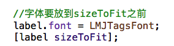
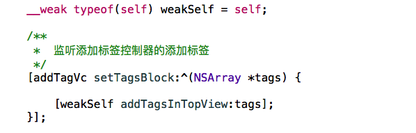
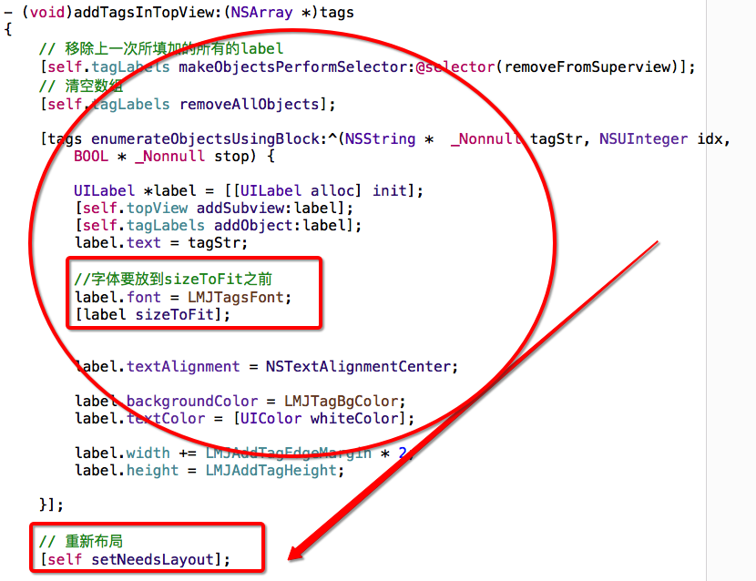
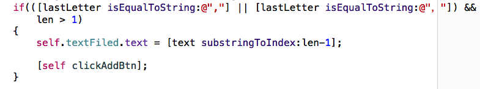
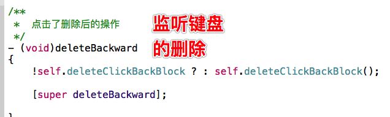
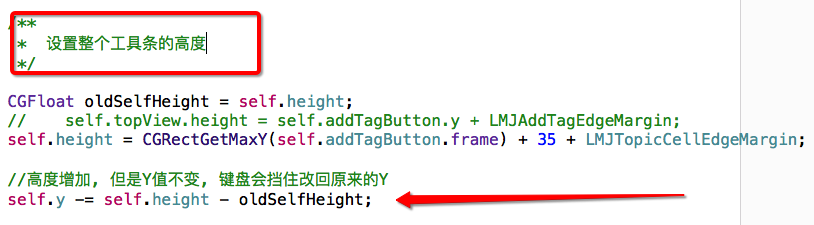
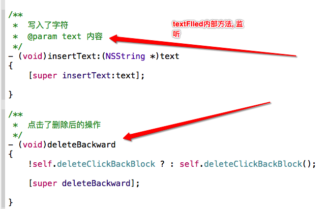

# Word2AddTag

- 1, 怎么从一个控件跳到额外的控制器

```objc


    // a modal 出 b
//    [a presentViewController:b animated:YES completion:nil];
//    a.presentedViewController -> b
//    b.presentingViewController -> a

    /**
     *需要modal的控制器
     */
    XMGAddTagViewController *vc = [[XMGAddTagViewController alloc] init];

    /**
     *  拿到跟控制器
     */
    UIViewController *root = [UIApplication sharedApplication].keyWindow.rootViewController;

    /**
     *  拿到跟控制器model出来的控制器, 而跟控制器modal出来的是导航控制器
     */
    UINavigationController *nav = (UINavigationController *)root.presentedViewController;

    //, modal控制器
    [nav pushViewController:vc animated:YES];

```




---



---



---



---



---



---


